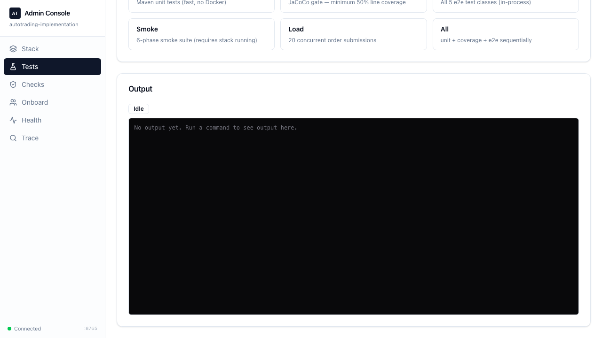
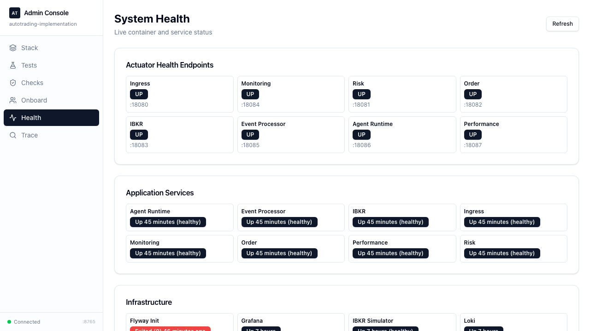
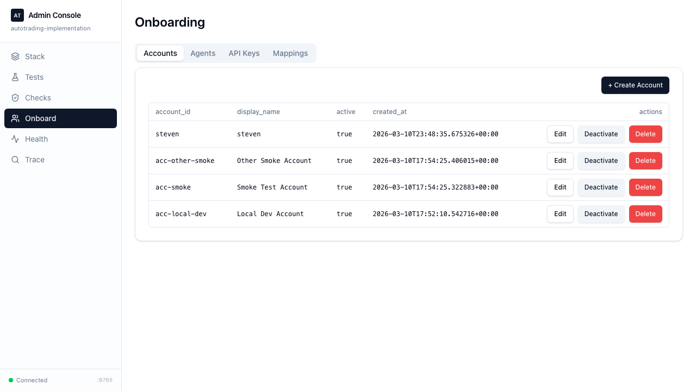

# autotrading-implementation

Production-grade paper-trading system: 8 microservices, contract-first gRPC + Kafka backbone,
PostgreSQL persistence, and a full observability stack.

## Start Here (2-minute setup)

1. Verify pinned spec baseline:
  ```bash
  python3 tools/spec_sync.py verify --dest specs/vendor --version-file SPEC_VERSION.json
  ```
2. Start local stack + run smoke:
  ```bash
  python3 scripts/stack.py up
  python3 scripts/smoke_local.py
  ```
3. Launch admin portal:
  ```bash
  python3 scripts/admin-ui.py
  ```
4. Open:
  - Admin UI: `http://localhost:8765`
  - Grafana: `http://localhost:3000`
  - Prometheus: `http://localhost:9090`
  - Redpanda Console: `http://localhost:8081`

| Item | Value |
|------|-------|
| Spec baseline | `spec-v1.0.1-m0m1` (pinned in `SPEC_VERSION.json`) |
| Language | Java 21 |
| Framework | Spring Boot 3.3.5 |
| Build | Maven multi-module — 12 modules — all `BUILD SUCCESS` |
| E2E tests | 48 green (2026-03-10) |
| Persistence | Spring Data JDBC + PostgreSQL 16 (10 Flyway migrations) |
| Messaging | Kafka via Redpanda (local) |
| RPC | gRPC 1.66.0 + Protobuf |
| Auth | Bearer API-key authentication — `ApiKeyAuthenticator` (SHA-256, in-memory cache) |

---

## Portal Visibility (Admin UI)

### Tests Page



### Health Page



### Onboard Page



For page details, see [Admin UI Pages](#admin-ui-pages).

---

## Table of Contents

1. [Start Here (2-minute setup)](#start-here-2-minute-setup)
2. [Portal Visibility (Admin UI)](#portal-visibility-admin-ui)
3. [Quick Start](#quick-start)
4. [Admin UI Pages](#admin-ui-pages)
5. [Architecture Overview](#architecture-overview)
6. [Services](#services)
7. [System Flow](#system-flow)
8. [Data Flow](#data-flow)
9. [Kafka Topics](#kafka-topics)
10. [Reliability Guarantees](#reliability-guarantees)
11. [Authentication and Account Model](#authentication-and-account-model)
12. [Database](#database)
13. [Tracing and Observability](#tracing-and-observability)
14. [Python Script Helpers](#python-script-helpers)
15. [Monorepo Layout](#monorepo-layout)
16. [Contributor Instructions](#contributor-instructions)
17. [Release Versioning](#release-versioning)

---

## Architecture Overview

```
External / Trader UI
        |  HTTP POST /ingress/v1/events
        |  Authorization: Bearer <api-key>
        v
  ingress-gateway-service
    ├─ ApiKeyAuthenticator (Bearer token → account_id, 401/403 if invalid)
    ├─ BrokerHealthCache   (circuit-breaker, rejects when broker DOWN → 503)
    └─ idempotency claim   (client_event_id dedup)
        |  ingress.events.normalized.v1  (Kafka)
  event-processor-service  --kafka-->  trade.events.routed.v1
        |
  agent-runtime-service  --gRPC-->  risk-service :19091
                                          |
                                    gRPC -->  order-service :19092
                                              ├─ BrokerHealthCache (second gate)
                                              └─ 60s timeout watchdog → FROZEN
                                                    |
                                            gRPC -->  ibkr-connector-service :19093
                                                        ├─ BrokerAccountCache (agent → account routing)
                                                        └─ IbkrHealthProbe (tickle every 30s)
                                                            |
                                                    fills.executed.v1  (Kafka)
                                                            |
                                                    performance-service

  monitoring-api  subscribes to  system.alerts.v1 + risk.events.v1
```

Transport split:
- **gRPC** — synchronous command path: agent-runtime → risk → order → ibkr-connector
- **Kafka (Redpanda)** — event backbone: all inter-service event publishing via outbox/inbox pattern

---

## Services

| Service | HTTP (local) | gRPC (local) | Role |
|---------|-------------|-------------|------|
| `ingress-gateway-service` | 18080 | — | HTTP ingest, normalize, idempotency dedup, publish to Kafka |
| `event-processor-service` | 18085 | — | Route normalized events → `trade.events.routed.v1` |
| `agent-runtime-service` | 18086 | — | Consume routed events, drive risk gRPC |
| `risk-service` | 18081 | 19091 | Policy evaluation, persist decisions, publish audit events |
| `order-service` | 18082 | 19092 | Order lifecycle, safety engine, 60 s timeout watchdog |
| `ibkr-connector-service` | 18083 | 19093 | Broker connector (IBKR / simulator), fill recording, health state |
| `performance-service` | 18087 | — | Position + PnL projection from fill events |
| `monitoring-api` | 18084 | — | Kill-switch, trading-mode controls, SSE dashboard |

---

## System Flow

For the rendered Mermaid flowchart see **[docs/SYSTEM_FLOW.md](docs/SYSTEM_FLOW.md)**.

Text summary of the end-to-end request path:

```
(1) HTTP POST /api/v1/trade-events
        |
(2) ingress-gateway-service
    - normalize + validate
    - idempotency claim (client_event_id)
    - persist -> ingress_raw_events
    - afterCommit() -> KafkaFirstPublisher
        |  ingress.events.normalized.v1
(3) event-processor-service
    - ConsumerDeduper (consumer_inbox)
    - route event
    - persist -> routed_trade_events
        |  trade.events.routed.v1
(4) agent-runtime-service
    - ConsumerDeduper
    - persist -> signals  (FIRST, before gRPC -- crash safe)
        |  gRPC EvaluateSignal
(5) risk-service
    - validateLineage()
    - SimplePolicyEngine.evaluate() -> APPROVE / DENY
    - persist -> risk_decisions, policy_decision_log
    - best-effort publish -> policy.evaluations.audit.v1
        |  gRPC CreateOrderIntent
(6) order-service
    - check tradingMode != FROZEN
    - check brokerHealthCache.isUp()
    - idempotency claim
    - persist -> order_intents, order_ledger, order_state_history
    - OrderTimeoutWatchdog (60 s poll)
        |  gRPC SubmitOrder
(7) ibkr-connector-service
    - idempotency claim
    - persist -> broker_orders
    - publish -> orders.status.v1
    - return broker_submit_id
        |  fills.executed.v1  (async, later)
(8) performance-service
    - ConsumerDeduper
    - atomic position update (ConcurrentHashMap.compute())
    - persist -> positions, pnl_snapshots
```

Key design decisions:

- **Two Kafka hops then synchronous gRPC** — hot path latency ~112 ms total
- **Persist-before-gRPC** — agent-runtime saves the signal to DB *before* calling risk,
  so a crash before the response is safe to replay
- **Bearer API key auth** — `ApiKeyAuthenticator` validates every ingress request; 400 for
  missing/non-Bearer header, 401 for unknown key, 403 if the agent doesn't belong to the caller's account
- **Broker health gate** — ingress-gateway and order-service both check `BrokerHealthCache`
  before forwarding; new orders are rejected when the broker is `DOWN`
- **Agent → account routing** — `BrokerAccountCache` resolves each `agent_id` to its IBKR
  external account ID, enabling multi-account sub-account routing at the connector layer
- **60 s watchdog** — `OrderTimeoutWatchdogLifecycle` polls every 5 s; if no ack within 60 s
  it sets `tradingMode = FROZEN` and publishes a `CRITICAL` alert on `system.alerts.v1`

---

## Authentication and Account Model

Full guide: **[docs/AUTH_AND_ACCOUNT_MODEL.md](docs/AUTH_AND_ACCOUNT_MODEL.md)**

All ingress requests require a `Bearer` API key. The lifecycle is:

```
HTTP Authorization: Bearer <raw-key>
    │
    ▼  SHA-256(raw-key)  →  look up in ApiKeyAuthenticator cache
    ├─ no header / non-Bearer       → 400 Bad Request
    ├─ unknown hash                 → 401 Unauthorized
    ├─ agent_id not in account      → 403 Forbidden
    └─ valid                        → principal_id = accountId, principal_json stored on event
```

### SmartLifecycle Phase Order

| Phase | Component | Role |
|-------|-----------|------|
| 40 | `ApiKeyAuthenticator` | Loads `account_api_keys` + agent ownership → in-memory SHA-256 cache |
| 40 | `BrokerAccountCache` | Loads `broker_accounts` → `agentId → externalAccountId` map |
| 50 | `BrokerHealthCache` | Polls `broker_health_status` → `brokerAvailable` boolean |
| 100 | `IbkrHealthProbe` | Runs `GET /tickle` → writes transitions to `broker_health_status` |
| 200+ | Tomcat / gRPC server | Begins accepting traffic — all caches already warm |

### Account data model (V10)

```
accounts (account_id PK)
    └── agents (agent_id PK, account_id FK)
    └── account_api_keys (key_hash PK, account_id FK)   -- many keys per account (rotation)
    └── broker_accounts (broker_account_id PK, agent_id UNIQUE FK) -- one broker acct per agent
```

Seed the local dev database or use `scripts/onboard.py` to manage accounts and keys.

---

## Data Flow

For the full annotated flow with code-level detail see **[docs/DATA_FLOW.md](docs/DATA_FLOW.md)**.

### Kafka-First Publishing (ingress-gateway only)

```
IngressService.accept()  @Transactional
    |- rawEventRepository.save()
    +- idempotencyService.markCompleted()

afterCommit() -> KafkaFirstPublisher
    |- Kafka OK  -> delivered to ingress.events.normalized.v1
    +- Kafka fail -> outbox_events  (PROPAGATION_REQUIRES_NEW TX)
              +- OutboxPollerLifecycle (500 ms) -> retry with doubling back-off
```

All other services publish directly (`DirectKafkaPublisher`) and roll back on Kafka failure,
relying on the uncommitted offset for re-delivery.

### Consumer-Side Deduplication (all services)

```
Kafka record -> @KafkaListener @Transactional
    +- ConsumerDeduper.runOnce(consumerName, eventId, work)
            |- INSERT consumer_inbox  -> conflict = already processed -> skip
            +- work.run()  in same TX
```

### Broker Health Guard (ingress-gateway + order-service)

Both services hold a `BrokerHealthCache` populated live by `IbkrHealthProbe`. When the cache
reports `DOWN`, calls to the command path are rejected immediately:

```
IngressService / OrderSafetyEngine
    +- brokerHealthCache.isUp()
           |- true  -> proceed
           +- false -> reject (SERVICE_UNAVAILABLE / FAILED_PRECONDITION)
```

`BrokerHealthPersister` persists each UP/DOWN transition to `broker_health_status`,
giving the monitoring-api a persistent audit trail of broker connectivity events.

---

## Kafka Topics

| Topic | Producer | Consumer(s) | Purpose |
|-------|----------|-------------|---------|
| `ingress.events.normalized.v1` | ingress-gateway | event-processor | Validated, normalized event after idempotency check |
| `ingress.errors.v1` | ingress-gateway | _(observability)_ | Failed / rejected ingress events |
| `trade.events.routed.v1` | event-processor | agent-runtime | Routed event ready for signal generation |
| `policy.evaluations.audit.v1` | risk-service | _(audit)_ | Full audit record of every risk evaluation |
| `risk.decisions.v1` | risk-service | _(observability)_ | ALLOW/DENY decision summary |
| `orders.status.v1` | ibkr-connector | order-service, monitoring-api | Broker status updates (SUBMITTED, FILLED, etc.) |
| `fills.executed.v1` | ibkr-connector | performance-service | Fill events for P&L and position tracking |
| `system.alerts.v1` | order-service | monitoring-api | System-level alerts (FROZEN, kill-switch) |
| `positions.updated.v1` | performance-service | _(downstream)_ | Real-time position changes |
| `pnl.snapshots.v1` | performance-service | _(downstream)_ | Point-in-time P&L snapshots |

All publishing uses `DirectKafkaPublisher` with doubling back-off (max 5 s budget).
`OutboxPollerLifecycle` (500 ms interval) runs only in `ingress-gateway-service`.

---

## Reliability Guarantees

| Guarantee | Mechanism |
|-----------|-----------|
| At-least-once + idempotent delivery | `idempotency_records` + `IdempotencyService` |
| Exactly-once consumer processing | `consumer_inbox` + `ConsumerDeduper` |
| Transactional outbox | `outbox_events` in same TX as domain write (ingress only) |
| Broker submit dedup | `broker_orders.order_ref` unique constraint |
| 60 s first-status watchdog | `OrderTimeoutWatchdogLifecycle` -> `UNKNOWN_PENDING_RECON` + `FROZEN` |
| Persist-before-gRPC safety | Signal saved before `riskStub.evaluateSignal()` |
| Crash-safe kill-switch | `system_controls` restored on `MonitoringController` startup |
| Broker health gate | `BrokerHealthCache` checked by ingress + order before connector call |
| Broker health persistence | `BrokerHealthPersister` writes UP/DOWN transitions to `broker_health_status` || API key authentication | `ApiKeyAuthenticator` (phase 40) — in-memory SHA-256 cache, 60 s refresh, survives DB blips |
| Agent ownership enforcement | `isAgentOwnedBy()` check in `IngressService` — 403 on cross-account agent use |
| Per-agent broker routing | `BrokerAccountCache` (phase 40) — maps `agent_id` → IBKR external account ID |
---

## Database

PostgreSQL 16 (`autotrading` database). Schema managed by Flyway — 10 migrations:

| Migration | What it adds |
|-----------|-------------|
| V1 | `idempotency_records`, `outbox_events`, `consumer_inbox`, `ingress_raw_events`, `routed_trade_events`, `order_intents`, `order_ledger`, `executions`, `system_controls`, `reconciliation_runs` |
| V2 | `ingress_errors`, `signals`, `risk_decisions`, `risk_events`, `policy_decision_log`, `policy_bundle_history`, `order_state_history`, `broker_orders`, `positions`, `pnl_snapshots` |
| V3 | Outbox retry back-off columns (`attempts`, `next_retry_at`) |
| V4 | `executions.broker_order_id` column |
| V5 | Fill missing columns across several tables |
| V6 | Drop cross-service foreign keys (service boundary isolation) |
| V7 | Convert `jsonb` columns to `TEXT` (Spring Data JDBC Rule 2) |
| V8 | Rename `idempotency_key` -> `client_event_id`; `ingress_event_id` -> `event_id` |
| V9 | `broker_health_status` — shared broker health state; seed row `broker_id='ibkr'` |
| V10 | `accounts`, `agents`, `account_api_keys`, `broker_accounts` — account/auth model; dev seed row |

Full schema: [db/migrations/](db/migrations/)

### Tables by Service

| Service | Tables |
|---------|--------|
| ingress-gateway | `idempotency_records`, `ingress_raw_events`, `outbox_events`, `account_api_keys` (R), `accounts` (R), `agents` (R) |
| event-processor | `consumer_inbox`, `routed_trade_events` |
| agent-runtime | `consumer_inbox`, `signals` |
| risk-service | `risk_decisions`, `risk_events`, `policy_decision_log` |
| order-service | `idempotency_records`, `order_intents`, `order_ledger`, `order_state_history`, `system_controls` |
| ibkr-connector | `idempotency_records`, `broker_orders`, `executions`, `broker_health_status` (R+W), `broker_accounts` (R) |
| performance | `positions`, `pnl_snapshots`, `executions` (R) |
| monitoring-api | `system_controls` (R), `reconciliation_runs` |
| _(shared auth)_ | `accounts`, `agents`, `account_api_keys`, `broker_accounts` — owned by no single service; seeded via `scripts/onboard.py` |

---

## Tracing and Observability

Full guide: **[docs/OBSERVABILITY.md](docs/OBSERVABILITY.md)**

### Local UIs (after `make up`)

| Tool | URL | Purpose |
|------|-----|---------|
| Grafana | http://localhost:3000 | Reliability dashboard, Loki log search, Tempo trace viewer |
| Prometheus | http://localhost:9090 | PromQL, alert status, scrape targets |
| Redpanda Console | http://localhost:8888 | Kafka topic browser, consumer-group lag |
| Loki | http://localhost:3100 | Log aggregation backend |
| Tempo | http://localhost:3200 | Distributed trace storage — service waterfall by `trace_id` |
| OTel Collector | grpc:4317 / http:4318 | Trace + log ingestion from all 8 services |

### MDC Log Fields

All 8 services emit these fields in every log line. Each is a first-class Loki filter key.

| Field | What it identifies |
|-------|--------------------|
| `trace_id` | One end-to-end request through the full stack. Auto-generated by the OTel Java agent; consistent across all service hops for one attempt. New value on every retry. |
| `request_id` | Originating `X-Request-Id` HTTP header or Kafka event ID. |
| `client_event_id` | Caller-supplied dedup key. Same key = same logical business request, even across retries. Unlike `trace_id`, a retried call shares the same `client_event_id` but gets a new `trace_id`. |
| `principal_id` | Authenticated account ID (`accountId` from `ApiKeyAuthenticator`). Populated after V10 auth wiring; was `"anonymous"` before. |
| `agent_id` | Trading agent driving this signal and order. |
| `signal_id` | Links agent-runtime logs -> risk-service logs for one decision. |
| `order_intent_id` | Links risk -> order-service -> ibkr-connector logs for one order lifecycle. |
| `instrument_id` | Traded symbol. Filters all activity on one symbol across all services. |

### MDC Join Chain

```
trace_id             -> ALL log lines for one attempt, all services
  +- client_event_id    -> was this NEW, REPLAY, or CONFLICT?
       +- signal_id        -> jump from agent-runtime into risk-service
            +- order_intent_id -> jump from risk -> order -> ibkr-connector
                 +- instrument_id  -> all activity on one symbol
```

`trace_id` is per-attempt. `client_event_id` is per-business-request. To understand whether a
retry was deduplicated, filter by `client_event_id` and look for `REPLAY` or `CONFLICT` outcomes.

### Trace a Request from the CLI

```bash
# Follow one request end-to-end (all services, time-ordered)
python3 scripts/trace.py --trace-id trc-abc-123

# Follow a business request across all retries
python3 scripts/trace.py --client-event-id k-abc-123

# All activity for an agent in the last 30 min
python3 scripts/trace.py --agent-id agent-alpha --since 30m

# Follow a signal through risk evaluation
python3 scripts/trace.py --signal-id sig-xyz --service risk-service

# Follow an order intent through order-service and broker
python3 scripts/trace.py --order-intent-id oi-xyz-789

# All AAPL activity across all services
python3 scripts/trace.py --instrument-id AAPL --since 1h

# Show only errors
python3 scripts/trace.py --trace-id trc-abc-123 --level ERROR

# Machine-readable JSON for piping
python3 scripts/trace.py --client-event-id k-abc-123 --json | jq '.[] | .line'
```

---

## Python Script Helpers

All scripts live in `scripts/`. Run from the repo root with `python3 scripts/<name>.py`.

---

### `scripts/stack.py` — Local Stack Manager

Wraps `docker compose` to manage the full local stack (25 containers).

```bash
# Full stack
python3 scripts/stack.py up              # start infra + all 8 app services
python3 scripts/stack.py down            # stop everything + remove volumes

# Iterative development (keep infra running, only restart app)
python3 scripts/stack.py infra-up        # start postgres, redpanda, observability
python3 scripts/stack.py app-up          # start 8 app services (requires infra up)
python3 scripts/stack.py restart-app     # stop app -> rebuild images -> start app
python3 scripts/stack.py app-down        # stop app only (infra stays)
python3 scripts/stack.py build           # rebuild app Docker images without starting

# Inspection
python3 scripts/stack.py status          # show running containers
python3 scripts/stack.py logs            # tail all service logs
python3 scripts/stack.py logs --service risk-service   # tail one service

# CI / validation
python3 scripts/stack.py validate        # status + smoke suite
python3 scripts/stack.py ci             # full clean run: down -> build -> up -> validate -> down
```

**Fast iteration pattern** (avoids the ~2 min Flyway + Redpanda init on each code change):
```bash
python3 scripts/stack.py infra-up        # once per dev session
# ...edit code...
python3 scripts/stack.py restart-app     # after each code change
python3 scripts/stack.py down            # end of session
```

---

### `scripts/smoke_local.py` — 6-Phase Smoke Suite

Runs against the live stack (requires `stack.py up` first). Any phase failure exits non-zero.

```bash
python3 scripts/smoke_local.py
# or via the master runner:
python3 scripts/test.py smoke
```

| Phase | What it validates |
|-------|-------------------|
| 0 — Auth DB seed | Seeds `accounts`, `agents`, `account_api_keys`, `broker_accounts` fixtures; waits for auth cache to warm |
| 1 — Readiness | All 8 services return `{"status":"UP"}` (360 s timeout) |
| 2 — Ingress idempotency | Duplicate `client_event_id` -> 202 with same `event_id`; conflicting payload -> 202 replaying original |
| 3 — Command path | Risk -> Order -> IBKR; two identical risk calls produce exactly one broker submit |
| 4 — Timeout freeze drill | 60 s watchdog triggers `trading_mode=FROZEN`; alert present on `system.alerts.v1` |
| 5 — Async Kafka pipeline | End-to-end: ingress POST -> broker `total_submit_count` increments within 90 s |
| 6 — Auth edge cases | Missing header → 400; non-Bearer → 400; unknown key → 401; cross-account agent → 403; valid → 202 |

Reports written to:
- `reports/blitz/e2e-results/smoke-local-<timestamp>.md` — human-readable pass/fail
- `reports/blitz/drill-logs/smoke-local-<timestamp>.json` — machine-readable detail

---

### `scripts/check.py` — Pre-Commit Gate

Runs all 8 required checks and prints a pass/fail summary. **All must be green before committing.**

```bash
python3 scripts/check.py                       # full gate (all 8 checks)
python3 scripts/check.py --fast                # skip e2e (checks 1-5, 7-8)
python3 scripts/check.py --skip-helm           # skip Helm checks
python3 scripts/check.py --only unit coverage  # run specific checks by name
```

| # | Name | What runs |
|---|------|-----------|
| 1 | `branch-check` | Branch name follows GitHub flow naming convention |
| 2 | `spec-verify` | Pinned spec baseline is current |
| 3 | `agent-sync` | `CLAUDE.md` is a symlink to `AGENTS.md` |
| 4 | `unit` | Reinstall contracts, then `mvn -B -DskipITs=true test` |
| 5 | `coverage` | `mvn -B -Pcoverage-core` on 5 core modules — minimum 50% line |
| 6 | `e2e` | `mvn -B -pl tests/e2e -am test` — all 5 e2e test classes (41 tests) |
| 7 | `helm-lint` | `helm lint infra/helm/charts/trading-service` |
| 8 | `helm-template` | `helm template` dry-run render |

---

### `scripts/test.py` — Master Test Runner

Single entry point for every test type — Maven suites, live smoke, load test, and manual trace.

```bash
# No live stack required
python3 scripts/test.py unit                                  # all unit tests
python3 scripts/test.py unit --module services/risk-service   # single module
python3 scripts/test.py coverage                              # JaCoCo gate on 5 core modules
python3 scripts/test.py e2e                                   # all 5 e2e test classes
python3 scripts/test.py all                                   # unit + coverage + e2e (fail fast)
python3 scripts/test.py all --no-fail-fast

# Requires live stack (python3 scripts/stack.py up first)
python3 scripts/test.py smoke                                 # 6-phase integration smoke suite
python3 scripts/test.py load                                  # 20-order concurrent load test
python3 scripts/test.py manual                                # single-event trace (defaults)
python3 scripts/test.py manual -- --agent-id my-agent --qty 5 --side SELL

# Full CI equivalent (stack must be up for the smoke phase)
python3 scripts/test.py full                                  # unit + coverage + e2e + smoke
```

---

### `scripts/onboard.py` — Account / Agent / API-key / Broker CLI

Manages the V10 auth tables directly in the local Postgres container.

```bash
# Accounts
python3 scripts/onboard.py account create acc-my-firm "My Firm"
python3 scripts/onboard.py account list

# Agents
python3 scripts/onboard.py agent create agent-alpha acc-my-firm "Alpha Strategy"
python3 scripts/onboard.py agent list acc-my-firm

# API keys
python3 scripts/onboard.py apikey generate acc-my-firm           # random key, shown once
python3 scripts/onboard.py apikey create acc-my-firm <raw-key>   # register a known key
python3 scripts/onboard.py apikey list   acc-my-firm
python3 scripts/onboard.py apikey revoke <sha256-hash>

# Broker account mapping
python3 scripts/onboard.py broker create agent-alpha DU123456
python3 scripts/onboard.py broker list
```

The smoke suite seeds its own test fixtures in Phase 0 (`seed_smoke_auth_db()`), so `onboard.py`
is mainly for manual dev or staging setup.

---

### `scripts/manual_trace.py` — Single-Event End-to-End Trace

Sends one ingress event, captures the OTel trace ID, tails Loki, polls the IBKR pipeline,
and opens Grafana Tempo links.

```bash
python3 scripts/manual_trace.py                                # defaults
python3 scripts/manual_trace.py --agent-id my-agent --qty 5 --side SELL
python3 scripts/manual_trace.py --token my-raw-key --skip-loki --no-browser
# or via master runner:
python3 scripts/test.py manual -- --agent-id my-agent --qty 5
```

---

### `scripts/trace.py` — Loki Log Tracer

Queries Loki from the terminal. Output is chronological across all services.

```bash
# Filter by MDC field
python3 scripts/trace.py --trace-id trc-abc-123
python3 scripts/trace.py --client-event-id k-abc-123
python3 scripts/trace.py --signal-id sig-xyz
python3 scripts/trace.py --order-intent-id oi-xyz-789
python3 scripts/trace.py --agent-id agent-alpha
python3 scripts/trace.py --instrument-id AAPL
python3 scripts/trace.py --request-id evt-bbb-456

# Scope
python3 scripts/trace.py --agent-id agent-alpha --service risk-service
python3 scripts/trace.py --trace-id trc-abc-123 --level ERROR
python3 scripts/trace.py --client-event-id k-abc-123 --since 2h

# Output
python3 scripts/trace.py --trace-id trc-abc-123 --json | jq '.[] | .line'
python3 scripts/trace.py --trace-id trc-abc-123 --loki-url http://loki.prod:3100
python3 scripts/trace.py --agent-id agent-alpha --verbose     # print the LogQL query
```

Default `--since` is `1h`. Supported durations: `30s`, `5m`, `2h`, `1d`, etc.

Sample output:
```
2026-03-09T04:21:01.123Z  ingress-gateway-service  INFO  ... client_event_id=k-abc-123 trace_id=trc-...
2026-03-09T04:21:01.201Z  agent-runtime-service    INFO  ... signal_id=sig-xyz ...
2026-03-09T04:21:01.310Z  risk-service             INFO  ... order_intent_id=oi-xyz-789 ...
2026-03-09T04:21:01.412Z  order-service            INFO  ... order_intent_id=oi-xyz-789 ...
2026-03-09T04:21:01.530Z  ibkr-connector-service   INFO  ... broker_submit_id=bsub-... ...
```

---

### `scripts/branch_check.py` — Branch Name Validator

```bash
python3 scripts/branch_check.py                    # check current branch
python3 scripts/branch_check.py feature/my-topic   # check a specific name
```

Valid patterns: `feature/<desc>`, `bugfix/<desc>`, `hotfix/<desc>`, `chore/<desc>`,
`release/<desc>`, `AT-<NNNN>-<desc>`, `main`, `develop`.

---

### `scripts/pr.py` — Safe Branch + Commit + Push + PR

```bash
python3 scripts/pr.py \
  --branch feature/my-topic \
  --title "feat(risk): add new policy rule" \
  --body "Closes #42"

python3 scripts/pr.py --commit-only ...   # commit only, skip push + PR creation
python3 scripts/pr.py --push-only ...     # push + create PR, skip commit
```

---

### `scripts/load_20_orders.py` — Load Test Helper

Sends 20 trade events to the local ingress gateway for smoke validation and manual perf testing.

```bash
python3 scripts/load_20_orders.py
```

---

### `tools/spec_sync.py` — Spec Sync

```bash
# Sync (downloads spec docs into specs/vendor)
python3 tools/spec_sync.py sync \
  --repo-url https://github.com/stevelefi/autotrading.git \
  --ref spec-v1.0.1-m0m1 \
  --dest specs/vendor \
  --version-file SPEC_VERSION.json

# Verify current baseline matches the pinned version
python3 tools/spec_sync.py verify \
  --dest specs/vendor \
  --version-file SPEC_VERSION.json
```

---

## Admin UI Pages

The local admin UI runs on `http://localhost:8765` (or `http://localhost:5173` in dev mode) and includes operational pages for testing, health, and onboarding.

### Tests Page (`/tests`)

- Purpose: run test commands from the UI with streamed logs.
- Supported commands: `unit`, `coverage`, `e2e`, and other script-backed test flows.
- Behavior: command buttons disable while a run is active, and each command shows a latest pass/fail indicator.


### Health Page (`/health`)

- Purpose: show stack health and trading-path visibility in one place.
- Displays:
  - Actuator readiness per application service.
  - Docker container status split by app services vs infrastructure.
  - Broker health (`broker_health_status` + connector status).
  - Recent ingress-to-trade activity (`ingress_raw_events` joined to `order_intents`/`order_ledger`).


### Onboard Page (`/onboard`)

- Purpose: manage account/auth/routing data used by ingress and command services.
- Tabs:
  - Accounts: create, edit, activate/deactivate, delete.
  - Agents: create, edit, move between accounts, activate/deactivate, delete.
  - API Keys: generate, activate/deactivate, revoke, delete.
  - Mappings (Broker Accounts): create, edit external account ID, activate/deactivate, delete.


Start the admin UI:

```bash
python3 scripts/admin-ui.py
```

Optional modes:

```bash
python3 scripts/admin-ui.py dev
python3 scripts/admin-ui.py build
python3 scripts/admin-ui.py install
```

---

## Quick Start

### Prerequisites

- Java 21 + Maven 3.9+
- Docker Desktop

### 1. Verify spec baseline

```bash
python3 tools/spec_sync.py verify --dest specs/vendor --version-file SPEC_VERSION.json
```

### 2. Run tests

```bash
python3 scripts/test.py unit
python3 scripts/test.py coverage
python3 scripts/test.py e2e
```

### 3. Bring up local stack and run smoke

```bash
python3 scripts/stack.py up
python3 scripts/smoke_local.py      # must exit 0 before any PR
python3 scripts/stack.py down
```

### 4. Pre-commit gate (all 8 checks)

```bash
python3 scripts/check.py
```

---

## Monorepo Layout

```
libs/
  contracts/          protobuf-generated gRPC stubs (Java)
  reliability-core/   idempotency, outbox/inbox, outbox poller, broker health cache

services/
  ingress-gateway-service/   HTTP ingest + idempotency + Kafka-first publish
  event-processor-service/   Kafka routing + inbox dedup
  agent-runtime-service/     Strategy + signal generation
  risk-service/              Policy evaluation via gRPC
  order-service/             Order lifecycle + 60 s watchdog + safety engine
  ibkr-connector-service/    Broker connector + fill tracking + health probe
  performance-service/       P&L + position tracking
  monitoring-api/            Control plane (trading-mode, kill-switch, SSE)

db/migrations/        Flyway V1-V10 SQL migrations (25 tables + auth model)
infra/local/          Docker Compose + env templates
infra/observability/  OTel Collector, Prometheus, Loki, Grafana, Tempo configs
infra/helm/           trading-service Helm chart
tests/e2e/            41 cross-service + migration tests (5 test classes)
reports/blitz/        Evidence pack (day reports, drill logs, smoke results)
scripts/              stack.py, smoke_local.py, check.py, test.py, trace.py, pr.py, branch_check.py
tools/                spec_sync.py
```

---

## Contributor Instructions

| Topic | Document |
|-------|----------|
| Implementation workflow, spec freeze, PR checklist | [docs/IMPLEMENTATION_INSTRUCTIONS.md](docs/IMPLEMENTATION_INSTRUCTIONS.md) |
| End-to-end data flow, Kafka-first publish, gRPC command chain | [docs/DATA_FLOW.md](docs/DATA_FLOW.md) |
| System flow Mermaid diagram, Kafka topics, DB tables per service | [docs/SYSTEM_FLOW.md](docs/SYSTEM_FLOW.md) |
| Monitoring UIs, Loki LogQL, trace.py, alert runbooks, DB inspection | [docs/OBSERVABILITY.md](docs/OBSERVABILITY.md) |
| Blitz change control and AI agent guardrails | [AGENTS.md](AGENTS.md) |
| Reliability drill runbooks | [docs/runbooks/reliability-drills.md](docs/runbooks/reliability-drills.md) |
| Account model, API key auth, BrokerAccountCache, onboard.py | [docs/AUTH_AND_ACCOUNT_MODEL.md](docs/AUTH_AND_ACCOUNT_MODEL.md) |
| Broker health circuit breaker, BrokerHealthCache, SmartLifecycle phases | [docs/BROKER_HEALTH_CIRCUIT_BREAKER.md](docs/BROKER_HEALTH_CIRCUIT_BREAKER.md) |

### Slack Agent Status

Caller workflow: `.github/workflows/agent-status.yml`
Uses reusable workflow from `stevelefi/autotrading-devops`

Required GitHub secrets: `SLACK_BOT_TOKEN`, `SLACK_CHANNEL_ID_STATUS`
Optional: `SLACK_ONCALL_GROUP_ID` (used for `BLOCKED` mentions)

---

## Release Versioning

Production tags are standardized to GitHub-common SemVer:

- Required format: `vMAJOR.MINOR.PATCH`
- Examples: `v1.0.0`, `v1.2.3`
- Optional prerelease (non-production): `v1.2.3-rc.1`, `v1.2.3-beta.2`
- Invalid examples: `1.0.0`, `impl-v1.0.0`, `v1.0`

Use these bump rules:

- `PATCH` (`x.y.Z`): backward-compatible bug fixes only
- `MINOR` (`x.Y.z`): backward-compatible feature additions
- `MAJOR` (`X.y.z`): breaking behavior/contract changes

Create annotated tags on `main` only:

```bash
git checkout main && git pull
git tag -a v1.0.0 -m "Release v1.0.0"
git push origin v1.0.0
```

Tag pushes are validated in CI; non-conforming tags fail fast.
