# System Flow — Services, Kafka, and Database

> **To view the diagram:** open this file in VS Code and press `⌘⇧V` (Mac) / `Ctrl+Shift+V` (Windows)
> to open the **built-in Markdown Preview**. The Mermaid diagram renders there via the
> `bierner.markdown-mermaid` extension.

## End-to-End Flow Diagram

```mermaid
flowchart TD
    classDef svc     fill:#dae8fc,stroke:#6c8ebf,color:#000,font-size:12px
    classDef grpcSvc fill:#ffe6cc,stroke:#d79b00,color:#000,font-size:12px
    classDef anlSvc  fill:#d5e8d4,stroke:#82b366,color:#000,font-size:12px
    classDef db      fill:#0e4d92,stroke:#003366,color:#fff,font-size:11px
    classDef kaf     fill:#fff3cd,stroke:#d6b656,color:#7a5800,font-size:11px
    classDef altKaf  fill:#f8cecc,stroke:#b85450,color:#8b0000,font-size:11px
    classDef cli     fill:#f5f5f5,stroke:#444444,color:#000,font-size:12px

    CLI["🖥 HTTP Client<br/>POST /v1/ingest"]:::cli

    IGW["ingress-gateway-service<br/>HTTP :8080 | gRPC :9090<br/>Idempotency dedup · Outbox dispatcher"]:::svc
    DB_IGW[(idempotency_keys<br/>ingress_events<br/>outbox_events)]:::db
    K_ERR[/"❌ ingress.errors.v1<br/>error / rejected events"/]:::altKaf
    K_NORM[/"ingress.events.normalized.v1<br/>3 partitions · key=agent_id"/]:::kaf

    EP["event-processor-service<br/>Kafka consumer<br/>Routes signals · Inbox dedup"]:::svc
    DB_EP[(routed_events<br/>consumer_inbox)]:::db
    K_ROUTED[/"trade.events.routed.v1<br/>3 partitions · key=agent_id"/]:::kaf

    AR["agent-runtime-service<br/>Kafka consumer | gRPC :9091<br/>Runs trading strategy · Generates signals"]:::svc
    DB_AR[(agents<br/>signals<br/>consumer_inbox)]:::db

    RISK["risk-service<br/>gRPC :9092 | EvaluateSignal RPC<br/>Policy evaluation · ALLOW / DENY"]:::grpcSvc
    DB_RISK[(risk_decisions<br/>policy_rules<br/>policy_decision_log)]:::db
    K_RDEC[/"risk.decisions.v1<br/>decision summary"/]:::kaf
    K_POL[/"policy.evaluations.audit.v1<br/>full evaluation record"/]:::kaf

    ORD["order-service<br/>gRPC :9093 | CreateOrder RPC<br/>Watchdog 60 s → FROZEN · Dedup + state machine"]:::grpcSvc
    DB_ORD[(order_intents<br/>order_ledger<br/>order_state_history<br/>system_controls)]:::db
    K_ALERTS[/"⚠ system.alerts.v1<br/>FROZEN / kill-switch alerts"/]:::altKaf

    IBKR["ibkr-connector-service<br/>gRPC :9094 | SubmitOrder RPC<br/>Broker submission · Execution tracking"]:::grpcSvc
    DB_IBKR[(broker_orders<br/>executions<br/>idempotency_keys<br/>broker_health_status)]:::db
    K_FILLS[/"fills.executed.v1<br/>execution fill events"/]:::kaf
    K_STATUS[/"orders.status.v1<br/>SUBMITTED / FILLED / REJECTED"/]:::kaf

    PERF["performance-service<br/>Kafka consumer | HTTP :8086<br/>P&amp;L tracking · Position management"]:::anlSvc
    DB_PERF[(positions<br/>pnl_snapshots<br/>executions read-only)]:::db
    K_POS[/"positions.updated.v1"/]:::kaf
    K_PNL[/"pnl.snapshots.v1"/]:::kaf

    MON["monitoring-api<br/>HTTP :8085 | gRPC :9095<br/>Read trading_mode · Raise / clear alerts"]:::anlSvc
    DB_MON[(system_controls read-only<br/>reconciliation_runs)]:::db

    CLI         -->|"① HTTP POST"| IGW
    IGW         -->|"② write"| DB_IGW
    IGW         -.->|"③ publish"| K_NORM
    IGW         -.->|"③b on error"| K_ERR

    K_NORM      -.->|"④ consume"| EP
    EP          -->|"⑤ write"| DB_EP
    EP          -.->|"⑥ publish"| K_ROUTED

    K_ROUTED    -.->|"⑦ consume"| AR
    AR          -->|"⑧ write"| DB_AR
    AR          ==>|"⑨ gRPC EvaluateSignal"| RISK

    RISK        -->|"⑩ write"| DB_RISK
    RISK        -.->|"⑩b publish"| K_RDEC
    RISK        -.->|"⑩c publish"| K_POL
    RISK        ==>|"⑪ gRPC CreateOrder"| ORD

    ORD         -->|"⑫ write"| DB_ORD
    ORD         -.->|"⑫b watchdog FROZEN"| K_ALERTS
    ORD         ==>|"⑬ gRPC SubmitOrder"| IBKR

    IBKR        -->|"⑭ write"| DB_IBKR
    IBKR        -.->|"⑮a publish fills"| K_FILLS
    IBKR        -.->|"⑮b publish status"| K_STATUS

    K_FILLS     -.->|"⑯a consume"| PERF
    K_STATUS    -.->|"⑯b feedback loop"| ORD

    PERF        -->|"⑰ write"| DB_PERF
    PERF        -.->|"⑰b publish"| K_POS
    PERF        -.->|"⑰c publish"| K_PNL

    K_ALERTS    -.->|"consume"| MON
    MON         -->|"read"| DB_MON

    %% note on gRPC arrow style: ==> thick = gRPC, --> normal = DB write, -.-> dashed = Kafka
```



### Key design notes

- **Two Kafka hops on the hot path** — HTTP → ingress publishes, event-processor picks up,
  agent-runtime picks up, then the rest is synchronous gRPC. Total: ~28ms for those two hops.
- **Risk → Order is an async fork** — `RiskDecisionGrpcService` calls `Context.current().fork()`
  so the gRPC response returns to agent-runtime early; CreateOrder continues in a forked context.
- **60s inactivity watchdog** — if no order is submitted within 60s, `OrderSafetyEngine`
  publishes a FROZEN alert on `system.alerts.v1`, blocking further orders until reset.
- **Outbox pattern** — ingress-gateway uses `outbox_events` + a polling dispatcher as a
  Kafka publish fallback. All other services publish directly via `DirectKafkaPublisher`.
- **Inbox dedup** — event-processor and agent-runtime write to `consumer_inbox` before
  processing to achieve exactly-once semantics at the application layer.
- **Broker health gate** — ingress-gateway and order-service check `BrokerHealthCache`
  (backed by `IbkrHealthProbe`) before forwarding to ibkr-connector. When the probe detects
  `DOWN`, new orders are rejected immediately. `BrokerHealthPersister` persists each
  UP/DOWN transition to `broker_health_status` for audit visibility.

---

## Kafka Topics

All topics: 3 partitions, replication factor 1 (local). Partition key = `agent_id`.

| Topic | Producer | Consumer(s) | Purpose |
|-------|----------|-------------|---------|
| `ingress.events.normalized.v1` | ingress-gateway | event-processor | Normalised ingress event after idempotency check |
| `ingress.errors.v1` | ingress-gateway | _(observability only)_ | Failed/rejected ingress events |
| `trade.events.routed.v1` | event-processor | agent-runtime | Routed trade event ready for signal generation |
| `policy.evaluations.audit.v1` | risk-service | _(audit log)_ | Full audit record of every risk policy evaluation |
| `risk.decisions.v1` | risk-service | _(observability only)_ | Risk ALLOW/DENY decision summary |
| `orders.intents.v1` | _(reserved)_ | _(reserved)_ | Future: async order intent dispatch |
| `orders.status.v1` | ibkr-connector | order-service | Broker status updates (SUBMITTED, FILLED, etc.) |
| `fills.executed.v1` | ibkr-connector | performance-service | Fill events for P&L and position tracking |
| `system.alerts.v1` | order-service | monitoring-api | System-level alerts (e.g. FROZEN, kill-switch) |
| `positions.updated.v1` | performance-service | _(downstream)_ | Real-time position changes |
| `pnl.snapshots.v1` | performance-service | _(downstream)_ | Point-in-time P&L snapshots |

---

## Database Tables per Service

All tables live in the shared PostgreSQL instance (`autotrading` schema).

### ingress-gateway-service

| Table | R/W | Purpose |
|-------|-----|---------|
| `idempotency_records` | R+W | De-duplicate incoming HTTP requests by `client_event_id` |
| `ingress_raw_events` | W | Persist raw event before publishing to Kafka |
| `outbox_events` | R+W | Transactional outbox — Kafka publish fallback with retry backoff |

### event-processor-service

| Table | R/W | Purpose |
|-------|-----|---------|
| `consumer_inbox` | R+W | Inbox dedup — prevents re-processing on Kafka re-delivery |
| `routed_trade_events` | W | Persisted routed trade event record |

### agent-runtime-service

| Table | R/W | Purpose |
|-------|-----|---------|
| `consumer_inbox` | R+W | Inbox dedup |
| `signals` | W | Signal generated from the trade event, linked to `routed_trade_events` |

### risk-service

| Table | R/W | Purpose |
|-------|-----|---------|
| `risk_decisions` | W | ALLOW/DENY decision with matched rule IDs and policy version |
| `policy_decision_log` | W | Latency-annotated log entry per evaluation |
| `risk_events` | W | Severity-tagged event log (INFO / WARN / ERROR) |

### order-service

| Table | R/W | Purpose |
|-------|-----|---------|
| `idempotency_records` | R+W | De-duplicate inbound gRPC CreateOrder calls |
| `order_intents` | W | Authoritative order record (instrument, side, qty, deadline) |
| `order_ledger` | R+W | Current state + version for optimistic locking |
| `order_state_history` | W | Append-only state transition log |
| `system_controls` | R+W | `trading_mode` flag read/written by the 60s watchdog |

### ibkr-connector-service

| Table | R/W | Purpose |
|-------|-----|---------|
| `idempotency_records` | R+W | De-duplicate inbound gRPC SubmitOrder calls |
| `broker_orders` | W | Broker-side order record with `order_ref` and `perm_id` |
| `executions` | W | Fill records (qty, price, commission) |
| `broker_health_status` | R+W | UP/DOWN health transitions — written by `BrokerHealthPersister`, seeded with `broker_id='ibkr'` |

### monitoring-api

| Table | R/W | Purpose |
|-------|-----|---------|
| `system_controls` | R | Read trading mode / kill-switch for `/consistency-status` |
| `reconciliation_runs` | R+W | Reconciliation job tracking |

### performance-service

| Table | R/W | Purpose |
|-------|-----|---------|
| `positions` | R+W | Running net position per agent + instrument |
| `pnl_snapshots` | W | Point-in-time P&L snapshots |
| `executions` | R | Read fills to compute P&L |

---

## Typical Latency Breakdown (from Tempo trace)

```
0ms      28ms      56ms               93ms    112ms
|--------|---------|-------------------|--------|
 2×Kafka   gRPC×3   order/ibkr DB writes  done
  hops    round-trips
```

| Segment | ~Time | Bottleneck |
|---------|-------|------------|
| HTTP → ingress DB + Kafka publish | 5ms | `ingress_raw_events` INSERT |
| Kafka: ingress → event-processor → agent-runtime | 23ms | 2× broker round-trip |
| gRPC: agent-runtime → risk → order → ibkr | 18ms | 3× serialise + network |
| Order + ibkr DB writes (8 INSERTs) | 25ms | sequential single-writer |
| **Total end-to-end** | **~112ms** | Kafka hops + DB INSERTs |
