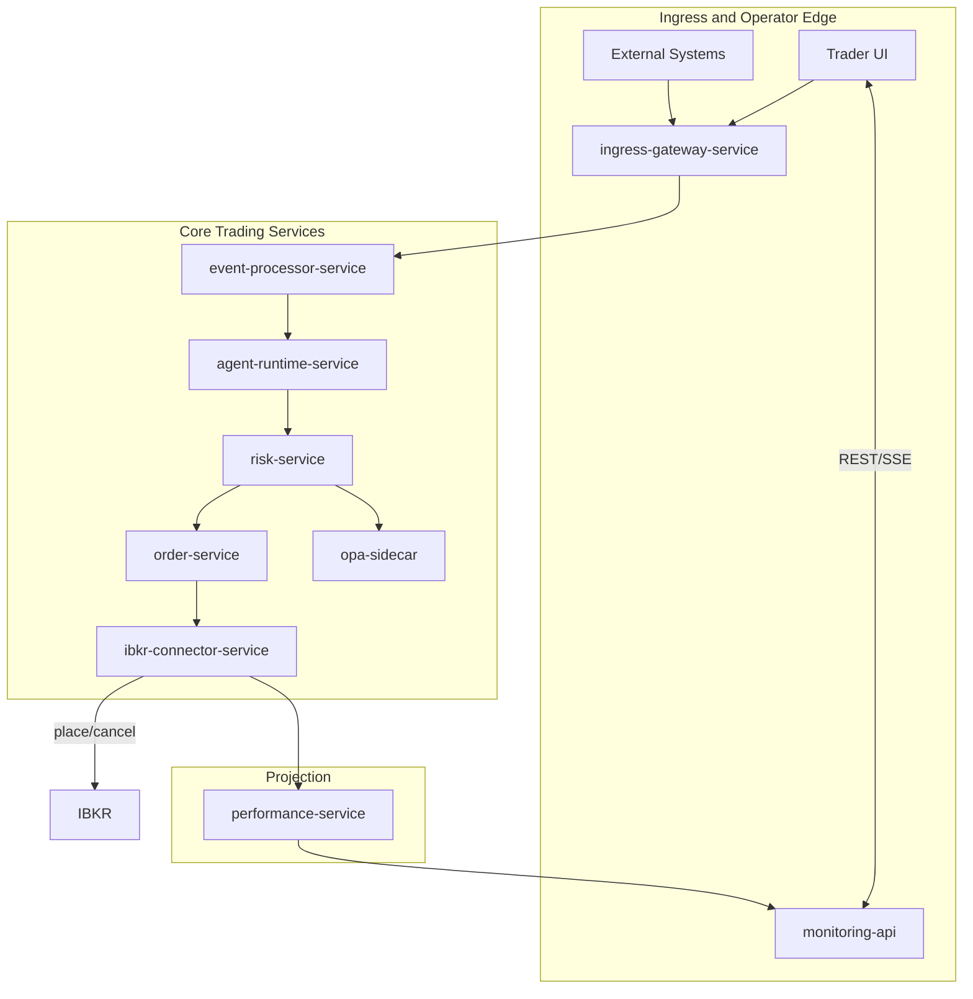
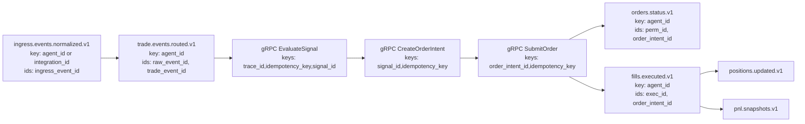
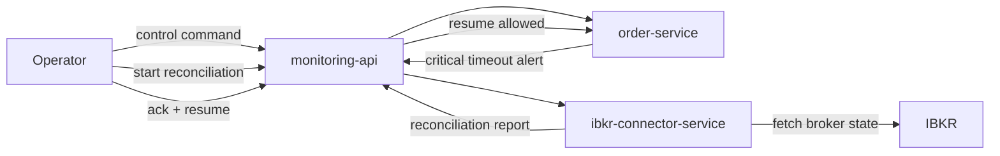
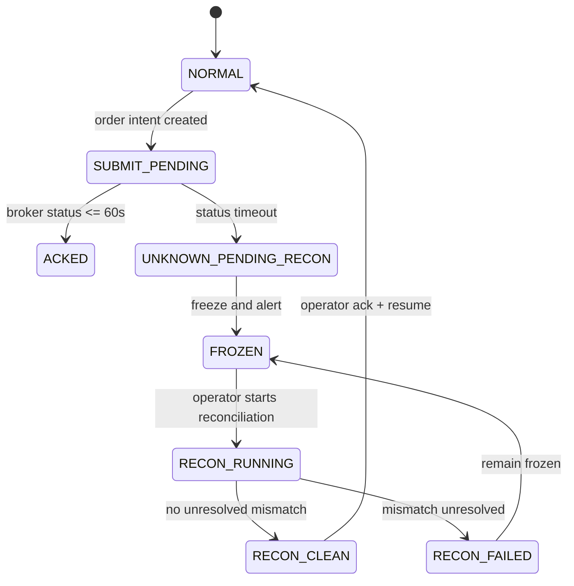

# Architecture Review Diagrams

This page is the review pack for architecture diagrams.
Each diagram is intentionally high-level and optimized for readability in design reviews.

## Diagram 1: Runtime Overview

Team review focus:
- Ingress boundary ownership and scope.
- Core service chain clarity.
- Monitoring path for operators.

## Diagram 2: Event Pipeline and Keys

Team review focus:
- Transport split clarity (Kafka backbone vs gRPC command path).
- Partition-key consistency.
- Lineage preservation through stages.
- Dedupe identity coverage.

## Diagram 3: Control and Recovery Loop

Team review focus:
- Freeze/reconcile/resume safety.
- Operator authority and audit flow.
- Broker comparison feedback path.

## Diagram 4: Team Ownership

```mermaid
flowchart TB
  TC["Trading Core"] --> AR["agent-runtime-service"]
  TC --> OS["order-service"]

  PP["Policy Platform"] --> RS["risk-service"]
  PP --> OPA["opa-sidecar"]

  BC["Broker Connectivity"] --> IC["ibkr-connector-service"]

  DP["Data Platform"] --> PS["performance-service"]
  DP --> DATA["Schema + retention + replay"]

  API["API and UI"] --> IG["ingress-gateway-service"]
  API --> MA["monitoring-api"]
  API --> UI["dashboard-ui"]

  SRE["SRE"] --> OPS["alerts + runbooks + SLOs"]
  QA["QA and Release"] --> GATES["test gates + signoff"]
  DX["Platform DevEx"] --> TOOLS["automation + docs pipeline"]
```

Team review focus:
- Clear primary owner per runtime boundary.
- Cross-team interfaces and handoff points.

## Diagram 5: Consistency Escalation Path

Team review focus:
- Legal state transitions.
- Recovery gate behavior.
- Operational escalation path.

## Cross-Team Review Checklist
1. Service boundaries and ownership are explicit.
2. Critical keys and lineage are preserved end-to-end.
3. Recovery path is deterministic and operator-controlled.
4. Design changes identify impacted teams and docs.

## Related Docs
- [Trading Architecture](./TRADING_ARCHITECTURE.md)
- [Production Plan](./PRODUCTION_PLAN.md)
- [Component Interactions and Documentation Plan](./design/17-component-interactions-and-doc-plan.md)
- [Component Contract Matrix](./design/19-component-contract-matrix.md)
