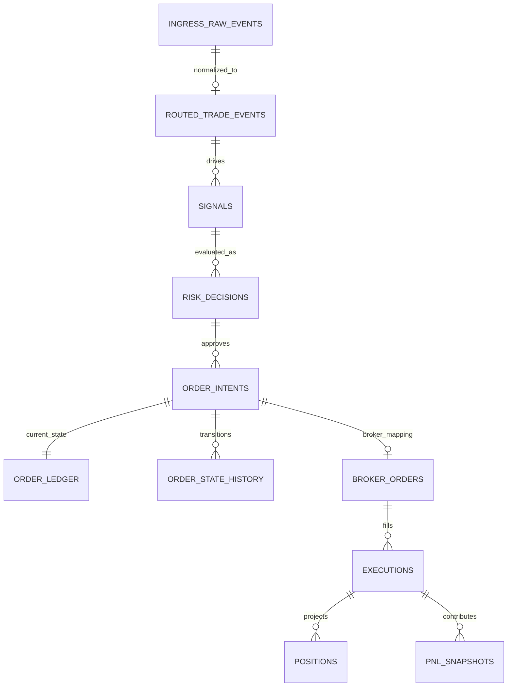

# Database Schema

This document defines the design baseline for authoritative PostgreSQL state.
It is aligned to the current ingress-first architecture and service boundaries.

## Schema Goals
1. Preserve immutable ingress audit history for all accepted/rejected submissions.
2. Enforce idempotency at write boundaries for ingress, signals, intents, and fills.
3. Keep order lifecycle deterministic under retries, replays, and broker callback duplication.
4. Guarantee freeze and reconciliation controls are persisted and auditable.

## Logical Domains
| Domain | Tables | Primary Owner |
|---|---|---|
| Ingress Audit and Routing | `ingress_raw_events`, `routed_trade_events`, `ingress_errors` | API/UI + Trading Core |
| Signal and Risk | `signals`, `risk_decisions`, `risk_events`, `policy_decision_log`, `policy_bundle_history` | Trading Core + Policy Platform |
| Order Lifecycle | `order_intents`, `order_ledger`, `order_state_history`, `broker_orders`, `executions` | Trading Core + Broker Connectivity |
| Projection and Analytics | `positions`, `pnl_snapshots` | Data Platform |
| Reliability and Controls | `outbox_events`, `consumer_inbox`, `reconciliation_runs`, `system_controls` | Data Platform + SRE |

## ER Diagram (High Level)

## Core Table Contracts

## `ingress_raw_events`
Immutable raw acceptance/audit record owned by `ingress-gateway-service`.

| Column | Type | Rules |
|---|---|---|
| `raw_event_id` | text | PK |
| `ingress_event_id` | text | unique |
| `trace_id` | text | not null |
| `request_id` | text | not null |
| `idempotency_key` | text | unique |
| `source_protocol` | text | `WEBHOOK|API|GRPC|WEBSOCKET` |
| `source_type` | text | `EXTERNAL_SYSTEM|TRADER_UI` |
| `source_event_id` | text | nullable |
| `integration_id` | text | required when `source_type=EXTERNAL_SYSTEM` |
| `agent_id` | text | nullable (required for agent-scoped intents) |
| `event_intent` | text | not null |
| `principal_json` | jsonb | normalized identity fields |
| `payload_json` | jsonb | not null |
| `ingestion_status` | text | `ACCEPTED|DUPLICATE|REJECTED` |
| `received_at` | timestamptz | UTC |

## `routed_trade_events`
Canonical routed event record produced by `event-processor-service`.

| Column | Type | Rules |
|---|---|---|
| `trade_event_id` | text | PK |
| `raw_event_id` | text | unique FK -> `ingress_raw_events.raw_event_id` |
| `ingress_event_id` | text | not null |
| `trace_id` | text | not null |
| `idempotency_key` | text | not null |
| `agent_id` | text | not null for agent-scoped routes |
| `instrument_id` | text | nullable |
| `source_type` | text | `EXTERNAL_SYSTEM|TRADER_UI` |
| `source_event_id` | text | nullable |
| `route_topic` | text | default `trade.events.routed.v1` |
| `routing_status` | text | `ROUTED|ROUTE_FAILED|SKIPPED_DUPLICATE` |
| `canonical_payload_json` | jsonb | not null |
| `created_at`, `routed_at` | timestamptz | UTC |

## `signals`
Produced by `agent-runtime-service` from routed events.

| Column | Type | Rules |
|---|---|---|
| `signal_id` | text | PK |
| `trade_event_id` | text | FK -> `routed_trade_events.trade_event_id` |
| `agent_id` | text | not null |
| `instrument_id` | text | nullable |
| `idempotency_key` | text | unique |
| `source_type` | text | `AGENT_RUNTIME` |
| `source_event_id` | text | nullable |
| `origin_source_type` | text | `EXTERNAL_SYSTEM|TRADER_UI|SYSTEM_INTERNAL` |
| `origin_source_event_id` | text | nullable |
| `raw_payload_json` | jsonb | not null |
| `signal_ts` | timestamptz | UTC |

## `risk_decisions`
Risk outcomes generated by `risk-service`.

| Column | Type | Rules |
|---|---|---|
| `risk_decision_id` | text | PK |
| `signal_id` | text | FK -> `signals.signal_id` |
| `trace_id` | text | not null |
| `decision` | text | `ALLOW|DENY` |
| `deny_reasons_json` | jsonb | not null |
| `policy_version` | text | not null |
| `policy_rule_set` | text | not null |
| `matched_rule_ids_json` | jsonb | not null |
| `failure_mode` | text | `NONE|OPA_TIMEOUT|OPA_UNAVAILABLE|OPA_SCHEMA_ERROR|BUNDLE_LOAD_ERROR` |
| `created_at` | timestamptz | UTC |

## `order_intents`
Order requests created by `order-service` from approved risk decisions.

| Column | Type | Rules |
|---|---|---|
| `order_intent_id` | text | PK |
| `signal_id` | text | FK -> `signals.signal_id` |
| `agent_id` | text | not null |
| `instrument_id` | text | nullable |
| `idempotency_key` | text | unique |
| `side` | text | `BUY|SELL` |
| `qty` | int | `> 0` |
| `order_type` | text | `MKT|LMT|STP` |
| `time_in_force` | text | `DAY|GTC` |
| `submission_deadline` | timestamptz | not null |
| `created_at` | timestamptz | UTC |

## `order_ledger`
Current authoritative order state.

| Column | Type | Rules |
|---|---|---|
| `order_intent_id` | text | PK, FK -> `order_intents.order_intent_id` |
| `state` | text | current state |
| `state_version` | bigint | monotonic |
| `submission_deadline` | timestamptz | not null |
| `last_status_at` | timestamptz | UTC |
| `updated_at` | timestamptz | UTC |

## `order_state_history`
Append-only order transition history.

| Column | Type | Rules |
|---|---|---|
| `order_intent_id` | text | FK -> `order_intents.order_intent_id` |
| `sequence_no` | bigint | monotonic per order |
| `from_state` | text | not null |
| `to_state` | text | not null |
| `reason` | text | nullable |
| `trace_id` | text | not null |
| `occurred_at` | timestamptz | UTC |
| PK | `(order_intent_id, sequence_no)` | unique transition |

## `broker_orders` and `executions`
Callback mapping and fill dedupe owned by `ibkr-connector-service`.

`broker_orders` key rules:
- `order_ref` unique and stable (`{agent_id}:{order_intent_id}`).
- `perm_id` unique when present.

`executions` key rules:
- `exec_id` is global dedupe key (PK).
- each row links to one `order_intent_id`.

## `positions` and `pnl_snapshots`
Projection tables owned by `performance-service`.

Key rules:
- `positions` PK: `(agent_id, instrument_id)`.
- `pnl_snapshots` immutable time-series with UTC `snapshot_ts`.

## `reconciliation_runs` and `system_controls`
Control/recovery tables used by `monitoring-api` + `order-service`.

Key rules:
- `system_controls` stores `kill_switch` and `trading_mode` with actor/timestamp.
- `reconciliation_runs` stores lifecycle (`STARTED|RUNNING|CLEAN|FAILED`) and mismatch summary.
- resume to `NORMAL` requires clean reconciliation + operator ack record.

## Reliability Tables

## `outbox_events`
- authoritative publisher queue for at-least-once event delivery.
- each business mutation that emits Kafka must write outbox row in same transaction.

## `consumer_inbox`
- consumer dedupe table by `(consumer_name, event_id)`.
- prevents duplicate side effects under retry/replay.

## Non-Negotiable Constraints
1. `ingress_raw_events.idempotency_key` is unique.
2. `ingress_raw_events(source_type, source_event_id)` is unique when `source_event_id` is present.
3. `routed_trade_events.raw_event_id` is unique.
4. `signals.idempotency_key` is unique.
5. `order_intents.idempotency_key` is unique.
6. `broker_orders.order_ref` is unique.
7. `executions.exec_id` is unique.
8. `order_state_history(order_intent_id, sequence_no)` is unique.
9. all timestamps use UTC `timestamptz`.

## Transaction Patterns

## Pattern A: Ingress Durable Accept + Publish
Within one transaction:
1. insert `ingress_raw_events` (dedupe by `idempotency_key` and source key),
2. insert outbox row for `ingress.events.normalized.v1`,
3. commit durable acceptance before async publish.

## Pattern B: Route Transform + Publish
Within one transaction:
1. consume normalized event with inbox dedupe,
2. insert `routed_trade_events`,
3. insert outbox row for `trade.events.routed.v1`.

## Pattern C: Order State Transition + Outbox
Within one transaction:
1. lock/update `order_ledger`,
2. append `order_state_history`,
3. insert outbox row for lifecycle topic.

## Pattern D: Fill Apply + Projection Update
Within one transaction:
1. inbox dedupe check,
2. insert `executions` (`exec_id` dedupe),
3. update `positions`,
4. append `pnl_snapshots`.

## Pattern E: Reconciliation Gate
1. create `reconciliation_runs` row,
2. persist mismatch summary,
3. transition system to resume only after clean result and explicit ack.

## Recommended Index Set (Minimum)
| Table | Index | Purpose |
|---|---|---|
| `ingress_raw_events` | `(source_type, source_event_id)` partial | external dedupe |
| `ingress_raw_events` | `(agent_id, received_at desc)` | ingress timeline |
| `routed_trade_events` | `(agent_id, created_at desc)` | routed timeline |
| `signals` | `(agent_id, signal_ts desc)` | signal timeline |
| `order_intents` | `(agent_id, created_at desc)` | order history |
| `order_ledger` | `(state, submission_deadline)` | timeout watchdog |
| `executions` | `(order_intent_id, fill_ts)` | projection feed |
| `outbox_events` | `(status, topic, created_at)` | publish dispatcher |
| `reconciliation_runs` | `(status, started_at desc)` | operations review |

## Migration Strategy
Use backward-compatible Flyway rollout:
1. additive schema change,
2. dual-read/write window if required,
3. cutover,
4. deferred cleanup.

## Schema Review Checklist
1. New table/column has owner, retention policy, and query purpose.
2. Every new event identity has dedupe key and uniqueness strategy.
3. Every mutation path defines transaction + rollback behavior.
4. Every control action is auditable with actor and trace fields.
5. Index impact reviewed for write-path and read-path behavior.
