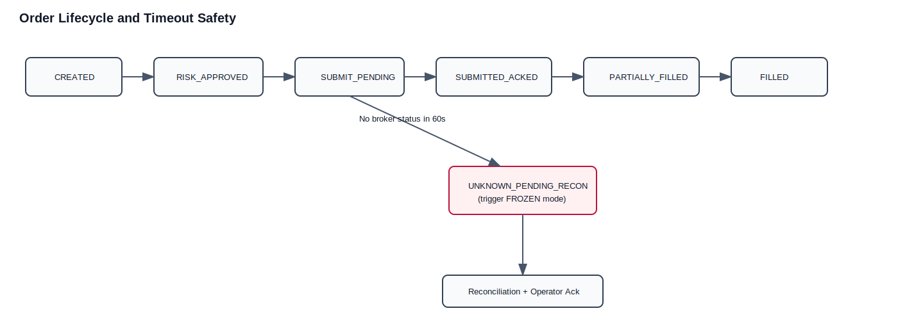

# Order Consistency and Reconciliation

## Visual Lifecycle

## Consistency Guarantees
1. Exactly-once intent creation in DB.
2. At-most-once broker submission per order intent from platform side.
3. Exactly-once execution accounting by `exec_id` dedupe.
4. Freeze on uncertain state.

## Required Fields
- `order_intent_id`
- `idempotency_key`
- `agent_id`
- `instrument_id`
- `submitted_at`
- `submission_deadline`

## State Machine
- `CREATED`
- `RISK_APPROVED`
- `SUBMIT_PENDING`
- `SUBMITTED_ACKED`
- `PARTIALLY_FILLED`
- `FILLED`
- `CANCELED`
- `REJECTED_BROKER`
- `UNKNOWN_PENDING_RECON`

Illegal transitions are rejected in transaction.

## 60-Second Deadline Rule
- On submit: set `submission_deadline = submitted_at + 60s`.
- If no broker status by deadline:
  - set order state to `UNKNOWN_PENDING_RECON`
  - set system `trading_mode=FROZEN`
  - emit P0 alert
  - do not auto-resubmit

## Duplicate Suppression
- Duplicate detection keys:
  - request path: `idempotency_key`
  - broker order mapping: `order_ref` and `perm_id` (when available)
  - execution accounting: `exec_id`
- Duplicate key behavior:
  - no new broker submission
  - return existing order reference/state

## Reconciliation Procedure
1. Freeze new opening orders.
2. Pull IBKR open orders, executions, positions.
3. Diff against local ledger.
4. Auto-resolve deterministic matches.
5. Persist unresolved mismatches and generate report.
6. Resume only with unresolved count = 0 and operator ack.

## Failure Modes
- Broker disconnect during submit/ack window -> unknown state + freeze.
- Duplicate callback -> ignored by `exec_id`/`perm_id` dedupe.
- Kafka outage -> outbox backlog, no state loss.
- Clock skew beyond threshold -> raise alert, block opening orders if uncertainty risk increases.

## Operational Best Practices
1. Reconciliation run must persist input snapshot and mismatch evidence.
2. Resume requires operator acknowledgement with actor identity.
3. Freeze transitions should be visible on dashboard and alert channels within seconds.
4. Incident postmortem must include order timeline reconstructed from ledger + callbacks.
