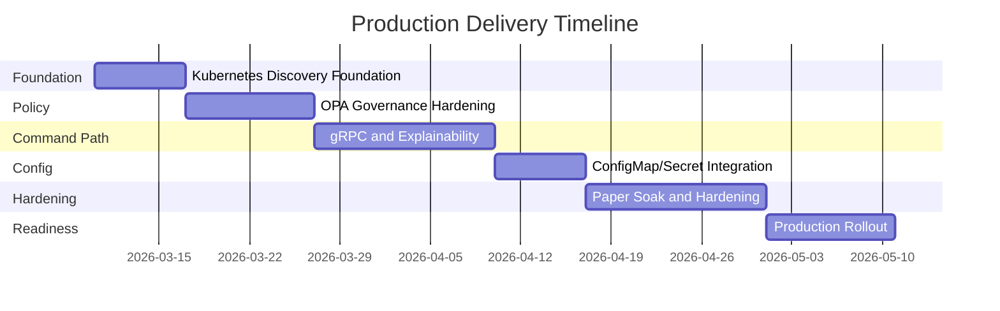
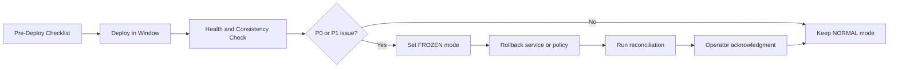

# Production Plan (Detailed)

## Objective
Deliver a safe, auditable, and scalable production rollout for IBKR automated trading with strict execution consistency.

## Production Principles
1. Consistency over availability when execution state is uncertain.
2. No unknown state without freeze and reconciliation.
3. Every release is measurable by explicit entry and exit criteria.
4. Team ownership and on-call escalation are pre-defined.

## Delivery Streams
- Stream A: Trading Core and Broker Path
- Stream B: Policy and Risk Governance
- Stream C: Data and Event Backbone
- Stream D: API, UI, and Operator Workflow
- Stream E: SRE and Runtime Operations
- Stream F: QA and Release Control
- Stream G: Platform DevEx and Automation

## Team Ownership Summary
Canonical ownership and full RACI details are defined in:
[Team Roles and Responsibilities (Canonical)](./TEAM_ROLES_AND_RESPONSIBILITIES.md)

| Team | Primary Production Accountability | Primary Repo |
|---|---|---|
| Trading Core | command path correctness, timeout/freeze safety | `autotrading-implementation` |
| Broker Connectivity | broker submit/callback correctness and dedupe | `autotrading-implementation` |
| Policy Platform | OPA governance, bundle promotion, fail-closed policy behavior | `autotrading-policy` |
| Data Platform | schema, outbox/inbox, replay and consistency durability | `autotrading-implementation` |
| API/UI | ingress and monitoring operator control experience | `autotrading-implementation` |
| SRE | runtime reliability, rollout/rollback operations | `autotrading-devops` |
| QA/Release | release gates and evidence certification | `autotrading-devops` |
| Platform DevEx | spec governance, CI/doc/task automation controls | `autotrading` |

## Milestone Timeline

## Milestone 1: Kubernetes Discovery Foundation
- Validate Kubernetes `Service` discovery and readiness behavior in paper namespace.
- Validate DNS-based service resolution for command-critical paths.
- Validate fail-closed behavior when no healthy endpoints are available.

## Milestone 2: Policy Governance and OPA Hardening
- Implement policy bundle CI gates (lint, unit, regression vectors, latency checks).
- Enforce signed bundle activation + explicit production approval.
- Lock OPA schema contracts and fail-closed reason taxonomy.

## Milestone 3: gRPC Command and Explainability Path
- Implement `EvaluateSignal`, `CreateOrderIntent`, and broker command gRPC services.
- Enforce metadata, idempotency, and timeout rules.
- Emit `policy.evaluations.audit.v1` and expose reject explainability fields.
- Keep Kafka for status/fills/projections.

## Milestone 4: ConfigMap/Secret Integration
- Integrate runtime config watchers for non-critical settings.
- Validate safe config apply and invalid-value rejection behavior.
- Validate last-known-good retention and controlled restart for critical settings.

## Milestone 5: Paper Soak and Hardening
- Execute failover drills (service, broker, Kubernetes DNS/discovery degradation).
- Confirm SLO/alert thresholds.
- Run 10 trading-day soak.

## Milestone 6: Production Rollout
- Progressive rollout with canary.
- Validate zero consistency regression and command latency targets.
- Execute final go/no-go signoff.

## Delivery Timeline (Visual)

## Gate Matrix
| Gate | Required Evidence | Owner |
|---|---|---|
| G1 Discovery Ready | Kubernetes Service/DNS health reports and probe evidence | SRE + Platform DevEx |
| G2 Policy Governance Ready | signed bundle checks + approval + rollback evidence | Policy Platform + SRE |
| G3 Command Contract Ready | gRPC contract + idempotency + explainability test reports | Trading Core |
| G4 Consistency Ready | timeout/duplicate/unknown-state test logs | Trading Core + Broker Connectivity |
| G5 Runtime Ready | alert dashboards + degraded Kubernetes discovery/config drill logs | SRE |
| G6 Soak Ready | 10-day soak report with no unexplained drift | QA/Release |
| G7 Production Go | cross-team signoff doc | Program Leads |

## Operational Metrics for Go-Live
- `duplicate_submit_count = 0`
- `unknown_pending_recon_open_count = 0` outside incidents
- `reconciliation_unresolved_count = 0` before resume
- `status_timeout_60s_count` below threshold and explained

## Rollback Strategy
1. Freeze opening orders.
2. Roll back services or policy bundle as required.
3. Run reconciliation.
4. Resume only after clean reconciliation and signoff.

## Release Command Center Flow

## Documentation and Governance
- Every release updates design docs and ADRs.
- Every incident updates runbooks and adds follow-up tasks.
- Task tracking remains canonical in `docs/tasks.yaml` + synced GitHub issues.
