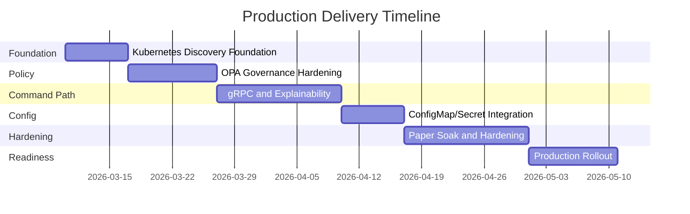
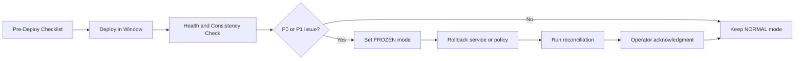

# Production Plan (Detailed)

## Objective
Deliver a safe, auditable, and scalable production rollout for IBKR automated trading with strict execution consistency.

## Production Principles
1. Consistency over availability when execution state is uncertain.
2. No unknown state without freeze and reconciliation.
3. Every release is measurable by explicit entry and exit criteria.
4. Team ownership and on-call escalation are pre-defined.

## Delivery Streams
- Stream A: Trading Core and Broker Path
- Stream B: Policy and Risk Governance
- Stream C: Data and Event Backbone
- Stream D: API, UI, and Operator Workflow
- Stream E: SRE and Runtime Operations
- Stream F: QA and Release Control
- Stream G: Platform DevEx and Automation

## Team Roles and Responsibilities

| Team | Primary Role | Main Responsibilities | Key Deliverables | Exit Criteria |
|---|---|---|---|---|
| Trading Core | Decision and lifecycle owner | Signal handling, gRPC command orchestration, order lifecycle state machine, timeout and freeze logic | deterministic state machine, gRPC idempotency guards, transition tests | zero duplicate intent creation, deterministic timeout-to-freeze behavior |
| Broker Connectivity | Broker integration owner | Single active writer, gRPC command endpoint, callback normalization, reconciliation connector behavior | lease/fencing, callback dedupe (`exec_id`, `perm_id`), reconnect/reconcile flow | no duplicate broker submissions, restart/reconnect validated in drills |
| Policy Platform | Policy governance owner | OPA bundle lifecycle, policy tests, fail-closed behavior | policy CI pipeline, bundle rollout/rollback tooling, decision version traceability | successful rollout+rollback rehearsal, fail-closed verified |
| Data Platform | State/event reliability owner | Schema evolution, outbox/inbox reliability, replay and retention strategy | migration set, compatibility checks, replay/rebuild procedures | restore+replay exercise passed, outbox backlog resilience proven |
| API/UI | Operator workflow owner | Monitoring API controls, dashboard UX, SSE reliability, operator visibility, ingress boundary UX | operational dashboards, audited mutating APIs, freeze/reconcile UX | UAT workflows pass, frozen/unknown state visibility validated |
| SRE | Runtime operations owner | Alerting, incident response, capacity/saturation baselines, Kubernetes runtime operations, rollback readiness | P0/P1 alert set, runbooks, discovery/config health baselines | incident drills meet MTTR target, rollback tested in prod-like env |
| QA/Release | Quality gate owner | E2E/chaos/soak execution, evidence collection, release gate enforcement | certification reports, release signoff checklist | 10-day paper soak passes, all P0/P1 scenarios pass with evidence |
| Platform DevEx | Delivery automation owner | CI checks, plan-sync automation, docs/site pipeline stability, ConfigMap/Secret promotion automation | required PR checks, issue/report automation, config promotion tooling | docs+automation pipelines green for 7 consecutive days |

## Team Interface Matrix
| Team | Primary Inputs | Primary Outputs | Depends On |
|---|---|---|---|
| Trading Core | routed trade events, policy decisions | gRPC order commands, lifecycle events | Policy Platform, Broker Connectivity, Data Platform |
| Broker Connectivity | gRPC command requests, broker callbacks | normalized status/fill events | Trading Core, SRE |
| Policy Platform | signal metadata, risk context | approve/reject decisions, policy version records | Trading Core |
| Data Platform | event streams, schema change requests | authoritative schema, replay/recovery capabilities | Trading Core, SRE |
| API/UI | projection streams, control commands | operator controls, dashboard state | Trading Core, Data Platform, SRE |
| SRE | telemetry, alerts, runbook events | operational readiness, incident response | all runtime teams |
| QA/Release | feature builds, test environments | release evidence, gate decisions | all implementation teams |
| Platform DevEx | workflow definitions, task data | CI/CD reliability, docs/site automation | QA/Release, API/UI |

## Milestone Timeline

## Milestone 1: Kubernetes Discovery Foundation
- Validate Kubernetes `Service` discovery and readiness behavior in paper namespace.
- Validate DNS-based service resolution for command-critical paths.
- Validate fail-closed behavior when no healthy endpoints are available.

## Milestone 2: Policy Governance and OPA Hardening
- Implement policy bundle CI gates (lint, unit, regression vectors, latency checks).
- Enforce signed bundle activation + explicit production approval.
- Lock OPA schema contracts and fail-closed reason taxonomy.

## Milestone 3: gRPC Command and Explainability Path
- Implement `EvaluateSignal`, `CreateOrderIntent`, and broker command gRPC services.
- Enforce metadata, idempotency, and timeout rules.
- Emit `policy.evaluations.audit.v1` and expose reject explainability fields.
- Keep Kafka for status/fills/projections.

## Milestone 4: ConfigMap/Secret Integration
- Integrate runtime config watchers for non-critical settings.
- Validate safe config apply and invalid-value rejection behavior.
- Validate last-known-good retention and controlled restart for critical settings.

## Milestone 5: Paper Soak and Hardening
- Execute failover drills (service, broker, Kubernetes DNS/discovery degradation).
- Confirm SLO/alert thresholds.
- Run 10 trading-day soak.

## Milestone 6: Production Rollout
- Progressive rollout with canary.
- Validate zero consistency regression and command latency targets.
- Execute final go/no-go signoff.

## Delivery Timeline (Visual)

## Gate Matrix
| Gate | Required Evidence | Owner |
|---|---|---|
| G1 Discovery Ready | Kubernetes Service/DNS health reports and probe evidence | SRE + Platform DevEx |
| G2 Policy Governance Ready | signed bundle checks + approval + rollback evidence | Policy Platform + SRE |
| G3 Command Contract Ready | gRPC contract + idempotency + explainability test reports | Trading Core |
| G4 Consistency Ready | timeout/duplicate/unknown-state test logs | Trading Core + Broker Connectivity |
| G5 Runtime Ready | alert dashboards + degraded Kubernetes discovery/config drill logs | SRE |
| G6 Soak Ready | 10-day soak report with no unexplained drift | QA/Release |
| G7 Production Go | cross-team signoff doc | Program Leads |

## Operational Metrics for Go-Live
- `duplicate_submit_count = 0`
- `unknown_pending_recon_open_count = 0` outside incidents
- `reconciliation_unresolved_count = 0` before resume
- `status_timeout_60s_count` below threshold and explained

## Rollback Strategy
1. Freeze opening orders.
2. Roll back services or policy bundle as required.
3. Run reconciliation.
4. Resume only after clean reconciliation and signoff.

## Release Command Center Flow

## Documentation and Governance
- Every release updates design docs and ADRs.
- Every incident updates runbooks and adds follow-up tasks.
- Task tracking remains canonical in `docs/tasks.yaml` + synced GitHub issues.
