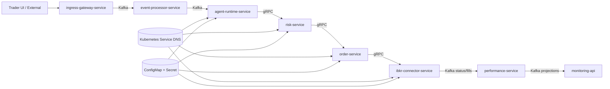

# Service Contracts

This page gives the team a high-level contract map.
Detailed protocol and schema definitions live in each service/topic contract file.

## Contract Topology (High Level)

## Contract Intent by Stage
| Stage | Contract Focus |
|---|---|
| Ingress | identity, idempotency, acceptance, raw-event durability |
| Routing | transformation and lineage preservation |
| Strategy/Risk | low-latency command integrity over gRPC |
| Order/Broker | gRPC command path + callback normalization |
| Projection/Monitoring | read-model freshness and operator visibility |
| Discovery/Config | Kubernetes service discovery and ConfigMap/Secret fail-safe behavior |

## Core Cross-Service Rules
1. Every critical mutation path is idempotent.
2. Event lineage is preserved through downstream stages.
3. Safety transitions (freeze/reconcile/resume) are explicit and auditable.
4. Breaking contract changes require versioned migration (`v2+`).

## Readiness and Extension Baseline
Current API/topic/service readiness and extension standards are tracked in:
- [Contracts Readiness and Extensibility](./CONTRACTS_READINESS_AND_EXTENSIBILITY.md)

Quick status:
| Surface | Current State |
|---|---|
| Service contracts | ready at high-level for all active services |
| API contracts | monitoring API is machine-validated; ingress REST/WebHook are documented but still missing OpenAPI |
| Topic contracts | topic catalog is complete; ingress topics and `policy.evaluations.audit.v1` currently have JSON schema files |

## Contract Files
- [Common Contract Conventions](./contracts/common.md)
- [Contracts Readiness and Extensibility](./CONTRACTS_READINESS_AND_EXTENSIBILITY.md)
- [Ingress Gateway Contract](./contracts/ingress-gateway-service.md)
- [Event Processor Contract](./contracts/event-processor-service.md)
- [Agent Runtime Contract](./contracts/agent-runtime.md)
- [Risk Service Contract](./contracts/risk-service.md)
- [Order Service Contract](./contracts/order-service.md)
- [IBKR Connector Contract](./contracts/ibkr-connector-service.md)
- [Performance Service Contract](./contracts/performance-service.md)
- [Monitoring API Contract](./contracts/monitoring-api.md)
- [Policy Bundle Contract](./contracts/policy-bundle-contract.md)
- [Policy Decision Audit Contract](./contracts/policy-decision-audit-contract.md)
- [Service Discovery and Config Contract](./contracts/service-discovery-and-config.md)
- [Internal Command Plane Proto](./contracts/protos/internal-command-plane.proto)
- [Kafka Event Contracts](./KAFKA_EVENT_CONTRACTS.md)
- [Cross-Service SLO and Error Budget](./contracts/cross-service-slo.md)
