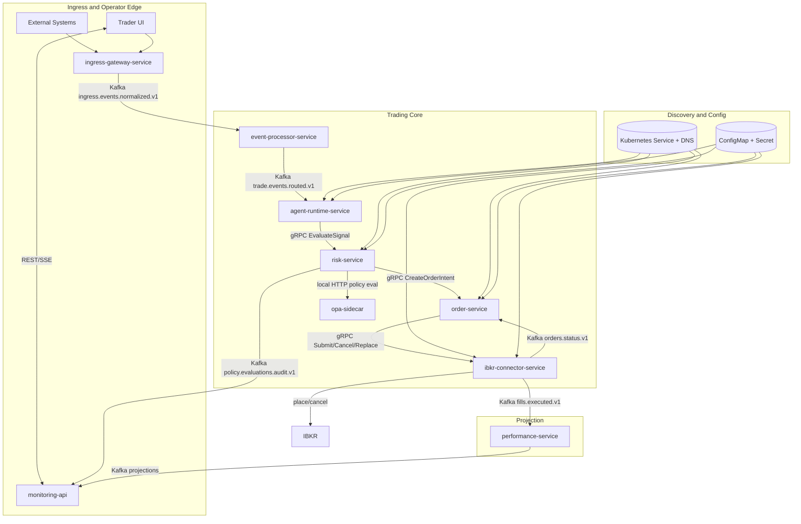

# Trading Architecture

This page provides a simplified architecture view for team alignment.
It focuses on boundaries and flow, not low-level implementation details.

## Architecture Goals
1. Keep event ingestion unified and predictable.
2. Keep service responsibilities clear and non-overlapping.
3. Keep safety controls explicit in the trading lifecycle.
4. Keep operations observable and recoverable.

## High-Level Topology

## Event Path (Simplified)
1. Event enters through `ingress-gateway-service`.
2. Ingress emits `ingress.events.normalized.v1`.
3. `event-processor-service` routes to `trade.events.routed.v1`.
4. `agent-runtime-service` calls `risk-service` via gRPC for real-time decisioning.
5. `risk-service` evaluates policies through local OPA sidecar and fails closed on policy-path errors.
6. `risk-service` emits policy evaluation audit events for explainability/compliance.
7. `risk-service` calls `order-service` via gRPC to create/reject order intents.
8. `order-service` calls `ibkr-connector-service` via gRPC for submit/cancel/replace.
9. `ibkr-connector-service` emits status/fills to Kafka for replay-safe downstream handling.
10. `performance-service` updates projections for `monitoring-api`.
11. Kubernetes `Service`/DNS provides discovery and `ConfigMap`/`Secret` provides runtime config for internal services.

## Ingress Layer (Simplified)
- Single ingress boundary for external and UI submissions.
- Async acceptance model with traceability and Kafka normalization.
- Mandatory idempotency for duplicate safety.
- Raw event durability before downstream publish.

## Service Responsibility Boundaries
| Service | Owns |
|---|---|
| `ingress-gateway-service` | Event intake boundary and normalized ingress stream |
| `event-processor-service` | Routing transformation from ingress to trade events |
| `agent-runtime-service` | Strategy signal generation |
| `risk-service` | Risk decisioning |
| `order-service` | Order lifecycle state |
| `ibkr-connector-service` | Broker interaction mapping |
| `performance-service` | Position/PnL read-model updates |
| `monitoring-api` | Control/query/SSE operator interfaces |

## Safety Model (High Level)
- Unknown execution states freeze new opening orders.
- Resume requires reconciliation and operator acknowledgment.
- Control actions are audited with trace context.
- Policy decisions are fail-closed and must include versioned explainability metadata.
- Production policy activation requires signed bundle verification and approval.

## Detailed Specs
Use the documents below when you need protocol, schema, or SLA detail.
- [Ingress Gateway Service Contract](./contracts/ingress-gateway-service.md)
- [Kafka Event Contracts](./KAFKA_EVENT_CONTRACTS.md)
- [Service Discovery and Config Contract](./contracts/service-discovery-and-config.md)
- [Internal Command Plane Proto](./contracts/protos/internal-command-plane.proto)
- [Service Contracts](./SERVICE_CONTRACTS.md)
- [Rule Engine (OPA)](./RULE_ENGINE_OPA.md)
- [Policy Bundle Contract](./contracts/policy-bundle-contract.md)
- [Policy Decision Audit Contract](./contracts/policy-decision-audit-contract.md)
- [Order Consistency and Reconciliation](./ORDER_CONSISTENCY_AND_RECONCILIATION.md)
