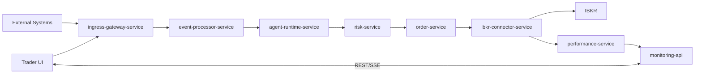

# Trading System Overview

## Purpose
This repository is the architecture source of truth for the trading platform.
This page gives a concise view of what the system is for and how it is structured.

## System Design Targets
The design is optimized for three outcomes:

- **Copy-trade workflows**: replicate public disclosures (for example, politician trade strategies) with policy and risk controls.
- **External AI signal intake**: accept third-party trade signals through a controlled, canonical ingress path.
- **Operator-first safety**: enforce human oversight, auditability, and fail-safe behavior.

See [Trading System Design Targets](./TRADING_SYSTEM_DESIGN_TARGETS.md) for detailed use cases and extension guidance.

## Current Design
1. `ingress-gateway-service` receives events from external systems and Trader UI.
2. Ingress authenticates, validates, deduplicates, and persists raw records.
3. Ingress publishes one canonical stream: `ingress.events.normalized.v1`.
4. Core flow remains fixed: strategy -> risk -> order -> broker -> performance.
5. Monitoring API/dashboard provide control, visibility, and safety workflows.

## Simplified Ingress Model
| Item | Current Design |
|---|---|
| Entry point | `ingress-gateway-service` |
| Sources | External (`WebHook`, `API`, `gRPC`), Trader UI (`API`, `WebSocket`) |
| Output topic | `ingress.events.normalized.v1` |
| Acceptance model | Async ack with `trace_id` and `ingress_event_id` |
| Safety minimum | Mandatory `idempotency_key` and durable raw record before publish |

## Simplified Service Flow

## Service Roles
| Service | Responsibility |
|---|---|
| `ingress-gateway-service` | Event intake, normalization, and ingress audit boundary |
| `event-processor-service` | Route normalized events to strategy/agent paths |
| `agent-runtime-service` | Produce strategy signals |
| `risk-service` | Enforce pre-trade policy and risk decisions |
| `order-service` | Own order intent and lifecycle state |
| `ibkr-connector-service` | Submit to broker and normalize callbacks |
| `performance-service` | Build position and PnL projections |
| `monitoring-api` | Provide operator read/query/control APIs |

## User Account, Agent, and IBKR Interaction
| Layer | Interaction Model |
|---|---|
| User account | A user account can own/manage one or more `agent_id` strategies. |
| Agent scope | `agent_id` is the trading actor key used for routing, policy, and order lifecycle. |
| Broker mapping | Each `agent_id` is mapped to an IBKR target account/profile (paper or prod). |
| Submission path | User/UI or external producer submits intent with `agent_id`; ingress validates submit permission for that scope. |
| Execution path | `risk-service` and `order-service` process the intent; `ibkr-connector-service` sends submit/cancel/replace to IBKR. |
| Broker correlation | Connector sets `order_ref={agent_id}:{order_intent_id}` for stable mapping across callbacks. |
| Broker feedback | IBKR callbacks are normalized to `orders.status.v1` and `fills.executed.v1`, then consumed by order/performance services. |
| Operator visibility | Monitoring API shows state and allows controlled actions (freeze/reconcile/resume) by account/agent scope. |

Key rules:
1. Users and external providers do not call IBKR directly through this platform.
2. Every command carries `trace_id` and `idempotency_key`; duplicate commands are dedupe-safe.
3. `orderStatus` is advisory; fill truth for accounting comes from `execDetails`-driven `fills.executed.v1`.
4. If execution state is uncertain, the system freezes opening orders until reconciliation.

## Operating Principles
1. Postgres is the system of record for state.
2. Kafka is the ingress and monitoring event backbone.
3. gRPC is the internal low-latency command path for buy/sell flow.
4. Safety takes priority when execution state is uncertain.
5. Critical operations are idempotent and traceable end-to-end.

## DevOps and Deployment Improvements (Recommended)
| Area | Recommended Technology | Why It Improves Delivery | Suggested Phase |
|---|---|---|---|
| GitOps deployment control | Argo CD + Helm | Declarative releases, drift detection, safer rollback | Phase 1 |
| Runtime config and secrets | Kubernetes `ConfigMap` + `Secret` + External Secrets Operator | Clear non-secret/secret split and secret-manager integration | Phase 1 |
| Progressive rollout | Argo Rollouts | Canary/blue-green and fast rollback on bad releases | Phase 2 |
| Cluster policy guardrails | Kyverno (or OPA Gatekeeper) | Enforce probes/resources/tag policies before runtime failures | Phase 2 |
| Supply-chain security | Trivy + Syft + Cosign | Vulnerability scan, SBOM generation, image signing | Phase 2 |
| Unified telemetry | OpenTelemetry + Prometheus/Loki/Tempo/Grafana | End-to-end trace + metrics/logs for faster incident triage | Phase 2 |
| Backup and recovery | Velero | Repeatable cluster-state backup/restore for disaster drills | Phase 3 |

## Runtime Config by Environment
1. Local: use `application-local.yml` and `.env.local` (gitignored); no Kubernetes config required.
2. Paper/Prod: use Kubernetes `Service` DNS for discovery, `ConfigMap` for non-secrets, `Secret` for sensitive values.
3. Critical settings: reject invalid config, keep last-known-good values, and roll changes with controlled restart.

## What This Page Is Not
1. Not a protocol-level API specification.
2. Not a topic-by-topic schema catalog.
3. Not an operational runbook.

Use detailed docs for implementation specifics.

## Related Docs
- [Trading Architecture](./TRADING_ARCHITECTURE.md)
- [Service Contracts](./SERVICE_CONTRACTS.md)
- [Spring Boot + Kubernetes Config Guide](./SPRINGBOOT_K8S_CONFIG_GUIDE.md)
- [Kubernetes Config and Secret Ownership Model](./K8S_CONFIG_OWNERSHIP_MODEL.md)
- [Ingress Gateway Contract](./contracts/ingress-gateway-service.md)
- [Kafka Event Contracts](./KAFKA_EVENT_CONTRACTS.md)
- [Order Consistency and Reconciliation](./ORDER_CONSISTENCY_AND_RECONCILIATION.md)
