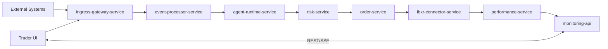

# Current Design Baseline

This baseline captures the current high-level runtime shape so teams can stay aligned.
It is intentionally concise.

## Canonical Service Set
| Service | Role |
|---|---|
| `ingress-gateway-service` | Unified ingress boundary for external + Trader UI events |
| `event-processor-service` | Convert normalized ingress events into routed trade events |
| `agent-runtime-service` | Generate strategy signals |
| `risk-service` | Evaluate policy and risk decisions |
| `order-service` | Own order lifecycle state machine |
| `ibkr-connector-service` | Broker integration and callback normalization |
| `performance-service` | Build position and PnL projections |
| `monitoring-api` | Operator control/query/SSE interface |
| `dashboard-ui` | Operator-facing UI |

## Baseline Flow

## Baseline Rules
1. Ingress is centralized and asynchronous.
2. Service chain is linear for decision and execution clarity.
3. Safety controls override throughput on uncertainty.
4. Contracts are versioned and backward-compatibility is explicit.

## Where to Find Details
- [Trading Architecture](./TRADING_ARCHITECTURE.md)
- [Service Contracts](./SERVICE_CONTRACTS.md)
- [Ingress Gateway Contract](./contracts/ingress-gateway-service.md)
- [Kafka Event Contracts](./KAFKA_EVENT_CONTRACTS.md)
