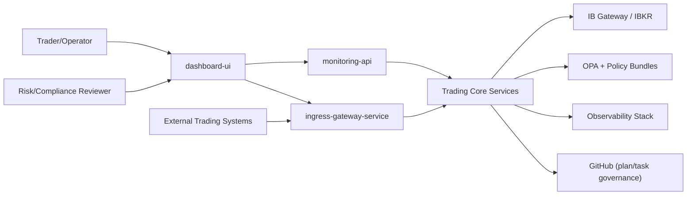
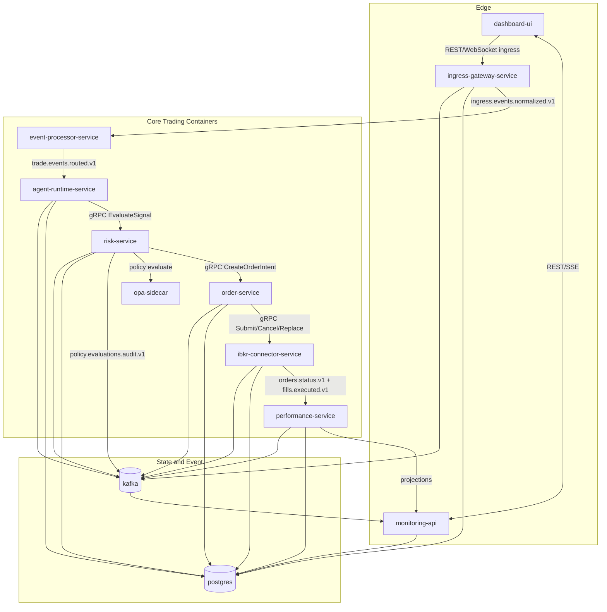

# 02 C4 Architecture

## Context View

## Container View

## Component View (Ingress and Order Path)
- Ingress protocol adapters (WebHook/API/gRPC/WebSocket)
- Ingress authn/authz and idempotency guard
- Immutable raw-event writer + outbox publisher
- Downstream event processing/routing
- Signal intake
- Policy evaluator
- Order ledger writer
- Broker adapter
- Status/fill projector
- Reconciliation engine

## Boundary Decisions
- Ingress gateway is the single public event-ingress authority.
- Monitoring API remains control/query and does not own new event ingress.
- Risk and policy are separate from order submission.
- Read models are decoupled from order-write ledger.
- Unknown state transitions prioritize safety over availability (freeze first).
