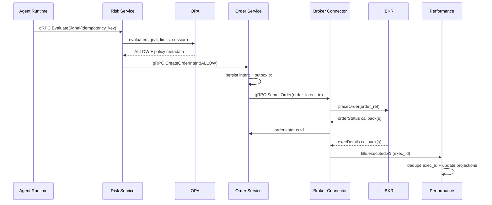
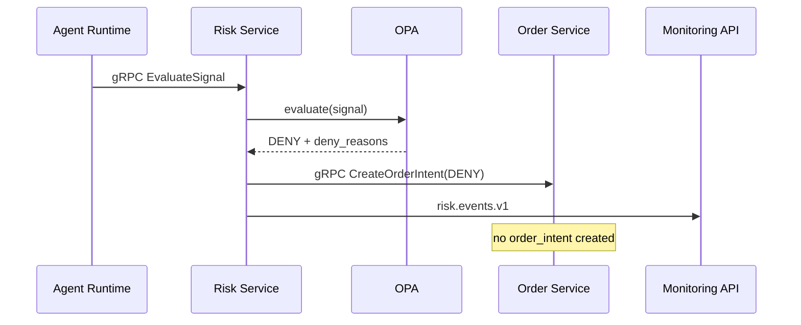
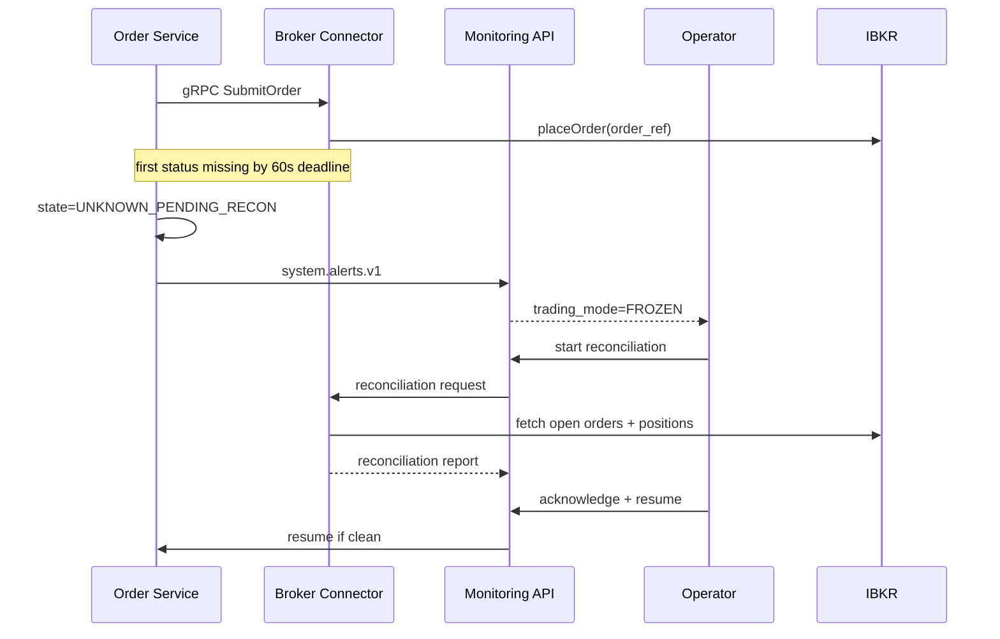
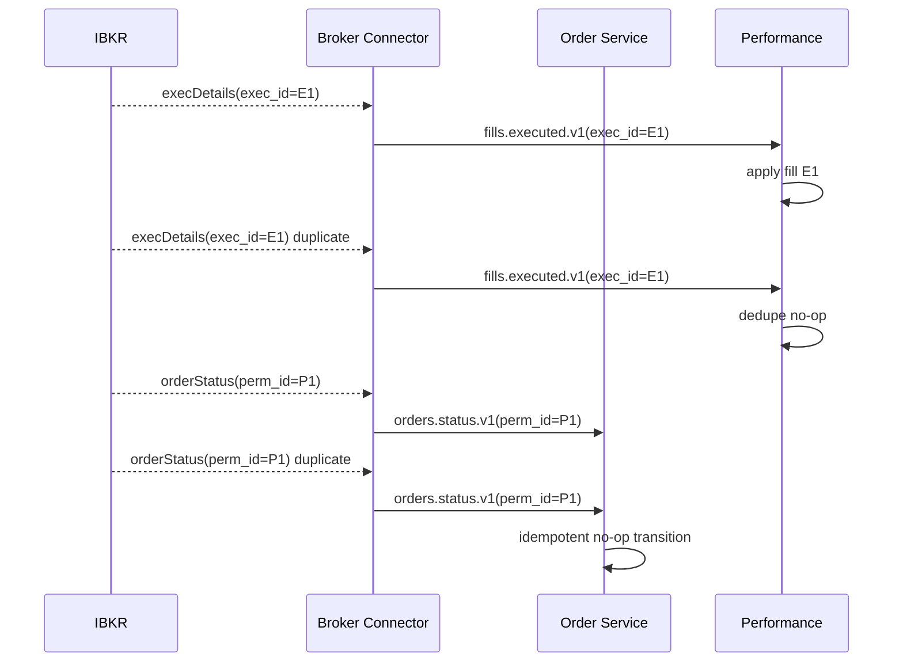

# 04 Sequence Diagrams

This document is the detailed sequence reference for runtime behavior.

## How to Read These Diagrams
- Event submission edge uses `ingress-gateway-service` (WebHook/API/gRPC/WebSocket).
- Control/query plane uses REST + SSE (`monitoring-api` as edge).
- Event plane uses Kafka topics (`*.v1`).
- State plane uses PostgreSQL (authoritative lifecycle records).
- Correlation keys are mandatory: `trace_id`, `agent_id`, `order_intent_id`.

## SD-01: Normal Execution Path (Allowed Signal)

Expected outcomes:
1. Exactly one effective order intent per signal `idempotency_key`.
2. Fill replay does not double-apply PnL due to `exec_id` dedupe.
3. UI observes the same lifecycle as persisted ledger state.

## SD-02: Risk Reject Path

Expected outcomes:
1. No broker submission on reject decisions.
2. Reject reason is auditable and visible to operators.

## SD-03: Submit Timeout -> Freeze -> Reconcile

Expected outcomes:
1. New order creation blocked while frozen.
2. Resume requires reconciliation completion and operator acknowledgment.
3. All steps carry actor and trace audit metadata.

## SD-04: Duplicate Callback Handling

Expected outcomes:
1. Exactly-once effective position updates.
2. Duplicate status/fill callbacks cannot create state drift.

## Validation Checklist
Use this checklist when reviewing implementations:
1. Sequence messages map to documented topics/endpoints.
2. Idempotency and dedupe keys are present at every boundary.
3. Timeout and freeze behavior matches `60s` rule.
4. Reconciliation + resume requires explicit operator action.
5. Test evidence exists for all 4 sequences.
