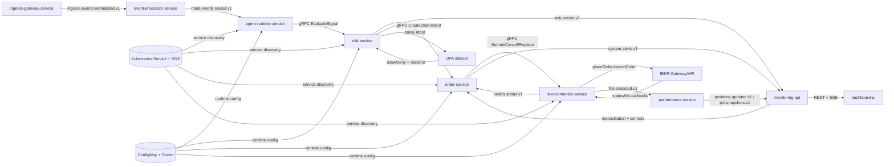
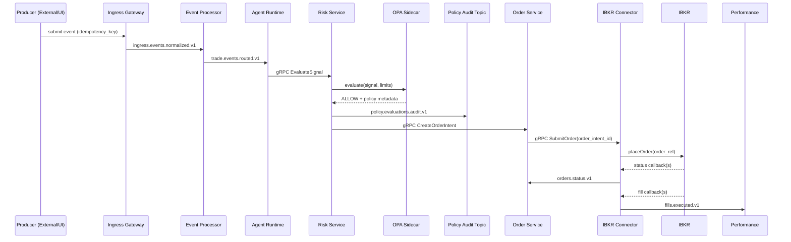
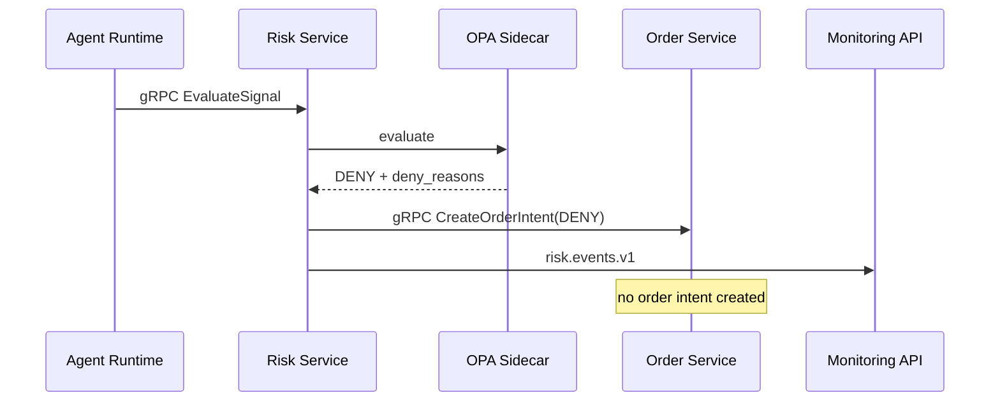
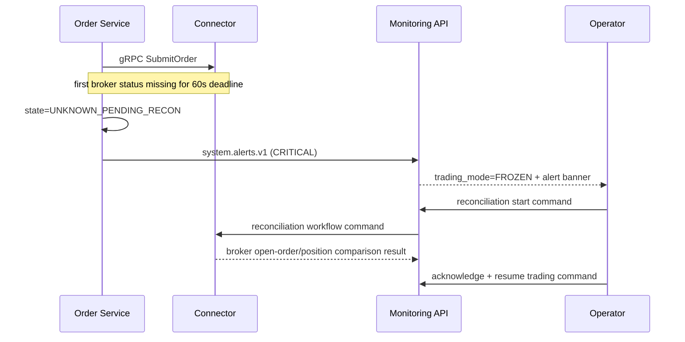

# 17 Component Interactions and Documentation Plan

## Purpose
This specification defines runtime interactions, failure behavior, and ownership boundaries so teams can implement a hybrid transport architecture without ambiguity.

Scope covers:
- Trading path: signal -> risk -> order -> broker -> fill -> position/PnL.
- Control path: kill switch, freeze mode, reconciliation, operator resume.
- Transport path: Kafka event backbone + gRPC command path.
- Discovery/config path: Kubernetes service discovery + ConfigMap/Secret runtime config.

## Interaction Planes
The system uses five interaction planes and each has explicit responsibilities.

1. Event plane (`Kafka`): asynchronous flow, replay, monitoring projections.
2. Command plane (`gRPC`): low-latency buy/sell command flow.
3. Control/query plane (`REST` + `SSE`): operator actions, read APIs, live updates.
4. State plane (`PostgreSQL`): authoritative lifecycle state and audit record.
5. Discovery/config plane (`Kubernetes`): service resolution and runtime overrides.

## Canonical Interaction Map


## Component Responsibility and Ownership
| Component | Core Responsibility | Owns State | Primary Team |
|---|---|---|---|
| `agent-runtime-service` | Produce normalized signals with immutable ids and call risk command API | signal metadata + outbox rows | Trading Core |
| `risk-service` | Evaluate policy and decide approve/reject, expose gRPC decision endpoint | decision records + risk events | Policy Platform |
| `order-service` | Own order lifecycle and command broker connector over gRPC | order ledger, status transition history | Trading Core |
| `ibkr-connector-service` | Broker session ownership + callback normalization + gRPC command endpoint | broker mapping (`order_ref`, `perm_id`, `exec_id`) | Broker Connectivity |
| `performance-service` | Update positions/PnL projections from fills/status | positions, pnl snapshots | Data Platform |
| `monitoring-api` | Operator control + query + SSE projection | operator read models + audit events | API/UI |
| `dashboard-ui` | Visualization + operator interaction | no authoritative state | API/UI |
| `OPA sidecar` | Policy decision engine | cached policy bundles | Policy Platform |
| `Kubernetes discovery/config` | Service discovery and runtime config source | service endpoints + ConfigMap/Secret | SRE + Platform DevEx |

## Boundary Contracts (Source -> Target)
| Source | Target | Channel | Contract | Idempotency and Keys | Timeout and Retry | Owner |
|---|---|---|---|---|---|---|
| `ingress-gateway-service` | `event-processor-service` | Kafka | `ingress.events.normalized.v1` | `ingress_event_id`, `idempotency_key`, `trace_id` | outbox publish + consumer dedupe | API/UI |
| `event-processor-service` | `agent-runtime-service` | Kafka | `trade.events.routed.v1` | `raw_event_id`, `trade_event_id`, `agent_id` | bounded transformation retry | Trading Core |
| `agent-runtime-service` | `risk-service` | gRPC | `RiskDecisionService.EvaluateSignal` | `idempotency_key`, `signal_id`, `trace_id`, `trade_event_id`, `origin_source_type` | client deadline + hedged retry with idempotency guard | Trading Core |
| `risk-service` | `order-service` | gRPC | `OrderCommandService.CreateOrderIntent` | `signal_id`, `idempotency_key`, `trace_id` | bounded retries on transient errors only | Policy Platform |
| `risk-service` | `policy audit consumers` | Kafka | `policy.evaluations.audit.v1` | `trace_id`, `signal_id`, `policy_version` | at-least-once publish with outbox | Policy Platform + Data Platform |
| `order-service` | `ibkr-connector-service` | gRPC | `BrokerCommandService.SubmitOrder/CancelOrder/ReplaceOrder` | immutable `order_intent_id`; `order_ref={agent_id}:{order_intent_id}` | connector retries only when dedupe-safe | Trading Core + Broker |
| `ibkr-connector-service` | `order-service` | Kafka | `orders.status.v1` | status keyed by `order_intent_id`, broker ids mapped by `perm_id` | if first status not received within 60s, move to `UNKNOWN_PENDING_RECON` | Broker Connectivity |
| `ibkr-connector-service` | `performance-service` | Kafka | `fills.executed.v1` | dedupe by `exec_id`; link to `order_intent_id` | at-least-once consumption with inbox dedupe | Broker + Data Platform |
| `performance-service` | `monitoring-api` | Kafka | `positions.updated.v1`, `pnl.snapshots.v1` | keyed by `agent_id` + `instrument_id` | projection rebuild from replay if lag/offset issues | Data Platform |
| `dashboard-ui` | `monitoring-api` | REST/SSE | `GET` queries, `POST` controls | actor id + request id on every mutation | API timeout and explicit error payload with `trace_id` | API/UI |
| `risk-service` | `OPA sidecar` | local HTTP | policy input/output JSON | decision includes `policy_version` | fail-closed on timeout; emit critical risk event | Policy Platform |
| runtime services | `Kubernetes` | Service DNS + API | service endpoint resolution + ConfigMap/Secret | service name + namespace + service account identity | fail closed when no healthy endpoint or valid critical config | SRE + Platform DevEx |

## Lifecycle Interaction Contracts

### Normal Execution Path


### Risk Reject Path


### Timeout -> Freeze -> Reconciliation


### Service Discovery and Config Path
```mermaid
sequenceDiagram
  participant S as Service
  participant D as Kubernetes DNS/Service
  participant K as ConfigMap/Secret

  S->>D: discover upstream by service name
  D-->>S: healthy endpoints
  S->>K: read/watch runtime config resources
  K-->>S: updated config values
  Note over S: invalid updates are rejected; last-known-good remains active
```

## Global Consistency Invariants
- `order_intent_id` is immutable and globally unique.
- `idempotency_key` must be unique per signal submission.
- Every order state transition must be persisted in same transaction as outbox event.
- gRPC command acknowledgments do not replace Kafka audit/event obligations.
- Any unknown broker state forces `trading_mode=FROZEN` before new intent creation.
- Fill processing must be exactly-once effective by dedupe key (`exec_id`) even with at-least-once delivery.
- All control mutations must write actor metadata and `trace_id` for audit.

## Timeout, Retry, and Backpressure Model
| Boundary | Timeout Rule | Retry Rule | Backpressure Rule |
|---|---|---|---|
| Signal -> risk decision (gRPC) | strict deadline budget from caller | retry only transient transport/unavailable errors with same `idempotency_key` | pause agents when risk queue or gRPC saturation crosses threshold |
| Risk decision -> intent create (gRPC) | strict internal processing budget | bounded retries with dedupe key | reject new signals when order ledger unhealthy |
| Intent -> connector submit (gRPC) | bounded submit ack deadline | retry only dedupe-safe command calls | fail closed if connector unavailable and no safe retry path |
| Intent -> first broker status (Kafka callback ingest) | 60-second hard deadline | connector retries submit only when broker ack absent and dedupe-safe | freeze trading if unknown state count > 0 |
| Fill -> position update | near-real-time projection target | replay from topic offset on failure | degrade dashboard freshness but preserve ledger writes |
| Kubernetes discovery/config | DNS/service resolution and config read budget | bounded retries with backoff | fail closed for command-critical calls when no healthy endpoint or valid critical config |
| SSE publish | bounded event lag target | reconnect with last-event-id | if lag high, show stale-data banner |

## OPA and Dynamic Policy Interaction
Policy behavior is runtime-configurable but bounded by safety constraints.

1. Risk service sends normalized input (`agent_id`, `instrument`, `side`, `qty`, `session`, `positions`, `daily_pnl`, system mode).
2. OPA returns decision payload (`ALLOW|DENY`, `policy_version`, `policy_rule_set`, `matched_rule_ids`, `deny_reasons`, `failure_mode`, optional computed limits).
3. If OPA unavailable or timeout occurs, risk service denies signal and emits critical risk event (fail-closed).
4. Policy bundle rollouts are versioned and reversible; every decision records `policy_version`.

## Observability and Trace Correlation
Required correlation identifiers across all boundaries:
- `trace_id`: cross-service request/event chain.
- `agent_id`: ownership and partition key.
- `order_intent_id`: lifecycle anchor.
- `order_ref`: broker mapping key.
- `exec_id`: fill dedupe key.

Minimum telemetry per boundary:
- counter: accepted, rejected, retried, failed.
- histogram: processing latency and queue lag.
- gauge: backlog depth, unknown state count, freeze mode status.
- discovery/config: DNS lookup latency, endpoint availability, config apply error rate.

## Test Plan for Interactions
| Scenario | Expected Interaction Outcome | Owner Team |
|---|---|---|
| Protocol parity for ingress | equivalent normalized event from WebHook/API/gRPC | API/UI + Data Platform |
| Duplicate signal command retry | exactly one effective risk/order command path | Trading Core + Policy |
| OPA timeout | risk reject + risk event + no intent creation | Policy Platform |
| Duplicate broker callback | exactly-once effective fill/state via `exec_id`/`perm_id` dedupe | Broker Connectivity |
| Status missing for 60s | order enters unknown state + freeze + alert + reconcile required | Trading Core + SRE |
| Kafka partition outage | outbox retries, no lost transitions, no duplicate effective transitions | Data Platform |
| Kubernetes DNS/service degradation | command-critical path fails closed and triggers alert | SRE + Trading Core |
| Invalid ConfigMap/Secret rollout | service rejects invalid config and retains last-known-good | SRE + Platform DevEx |
| Postgres failover/restart | consumer resumes; no duplicate order intents | Data Platform + Trading Core |

## Documentation Execution Plan
### Phase 1: Contract Lock
- Lock boundary fields and idempotency rules in `docs/contracts/*.md`.
- Publish `docs/contracts/protos/internal-command-plane.proto`.
- Add Kubernetes discovery/config contract in `docs/contracts/service-discovery-and-config.md`.
- Ensure topic and API examples include correlation keys.

### Phase 2: Failure and Control Path Lock
- Align timeout/freeze/reconcile behavior between architecture and runbooks.
- Align degraded discovery/config behavior with fail-closed policy.
- Map each critical interaction to alert and runbook step.

### Phase 3: Team Handoff and Release Gates
- Convert each boundary into tasks with owner, tests, and evidence requirements.
- Enforce contract review gate on breaking changes.
- Require game-day evidence for timeout/freeze/reconcile and Kubernetes discovery/config degradation before live enablement.

## Review Cadence
- Weekly cross-team architecture review: Trading Core, Broker Connectivity, Policy Platform, Data Platform, API/UI, SRE, Platform DevEx.
- Contract review required for any schema/proto/state-transition change.
- Release review required before enabling new strategy or policy package in production mode.
