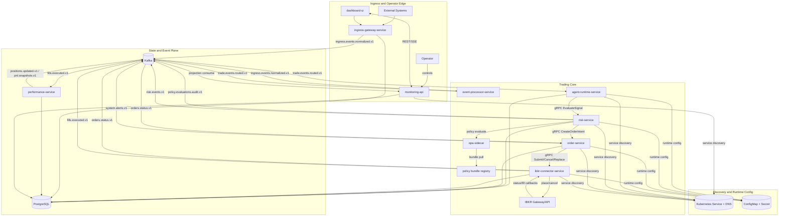
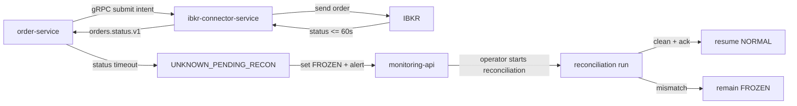

# 02 Reference Architecture

## System Diagram (High Level)

## Safety Control Loop

## Architectural Boundaries
- Ingress is centralized in `ingress-gateway-service` and remains Kafka-backed.
- Broker connectivity is isolated to `ibkr-connector-service`.
- `agent-runtime-service`, `risk-service`, `order-service`, and `ibkr-connector-service` use gRPC for buy/sell command path.
- OPA sidecar per `risk-service` pod is authoritative for pre-trade allow/deny.
- Policy-path evaluation stays local to pod and does not use serverless/remote policy calls in hot path.
- Kafka remains the event backbone for ingress, broker status/fill events, and monitoring projections.
- Kubernetes `Service`/DNS provides service discovery and `ConfigMap`/`Secret` provides runtime config.
- Postgres is source of truth for lifecycle state.
- Control actions enter through `monitoring-api` and must be audited.

## Deployment Profile (Initial and Target)
- Planning baseline for local, paper, and production environments.
- Single active connector writer.
- Kafka replication strategy evolves by phase.
- Kubernetes runtime profile evolves by phase (`paper` namespace baseline to production multi-zone cluster profile).
- Postgres backup and recovery strategy required before live promotion.

## Runtime Modes
- `NORMAL`: trading open under policy controls.
- `FROZEN`: new opening orders blocked.
- `KILL_SWITCH`: all new order intents blocked globally.

## Best-Practice Controls (Normative)
1. Order command path MUST be idempotent across gRPC retries and restarts.
2. Missing first status within 60 seconds MUST trigger unknown+freeze path.
3. Resume from freeze MUST require reconciliation + explicit operator ack.
4. OPA evaluation failures for opening orders MUST fail closed.
5. Discovery/config degradation MUST not allow unsafe best-effort trading operations.
6. Clock discipline MUST enforce UTC timestamps and bounded drift.
7. Broker connector MUST maintain single active writer semantics.
8. Ingress events MUST be durably persisted before routed publish.

## Related References
- [Trading Architecture](../TRADING_ARCHITECTURE.md)
- [Rule Engine (OPA)](../RULE_ENGINE_OPA.md)
- [Policy Bundle Contract](../contracts/policy-bundle-contract.md)
- [Policy Decision Audit Contract](../contracts/policy-decision-audit-contract.md)
- [Service Discovery and Config Contract](../contracts/service-discovery-and-config.md)
- [Internal Command Plane Proto](../contracts/protos/internal-command-plane.proto)
- [Order Consistency and Reconciliation](../ORDER_CONSISTENCY_AND_RECONCILIATION.md)
- [Trading Best Practices Baseline](../TRADING_BEST_PRACTICES_BASELINE.md)
