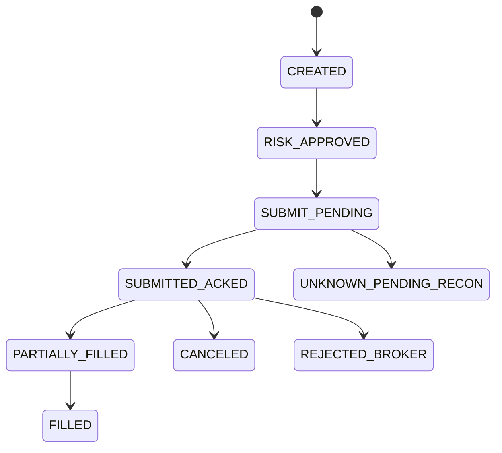

# 03 Domain Model and Data Contracts

## Core Entities
- IngressRawEvent
- RoutedTradeEvent
- Agent
- Signal
- OrderIntent
- OrderLedgerState
- BrokerOrder
- Execution
- Position
- PnlSnapshot
- ReconciliationRun
- PolicyDecision
- PolicyEvaluationAudit

## Primary Keys and Identity
- `agent_id`: logical trading actor
- `instrument_id`: tradable instrument reference
- `ingress_event_id`: immutable ingress acceptance identity
- `raw_event_id`: immutable ingress raw record identity
- `trade_event_id`: immutable routed event identity
- `idempotency_key`: dedupe identity for requests
- `order_intent_id`: immutable order lifecycle key
- `exec_id`: immutable broker fill key
- `signal_id`: immutable policy evaluation anchor for decision traceability

## Order State Machine

## Table Contracts
### `ingress_raw_events`
- MUST store: `raw_event_id`, `ingress_event_id`, `trace_id`, `idempotency_key`, `source_protocol`, `source_type`, `event_intent`, `payload_json`, `ingestion_status`, `received_at`
- Unique: `ingress_event_id`, `idempotency_key`

### `routed_trade_events`
- MUST store: `trade_event_id`, `raw_event_id`, `ingress_event_id`, `idempotency_key`, `agent_id`, `routing_status`, `canonical_payload_json`
- Unique: `raw_event_id`

### `order_intents`
- MUST store: `order_intent_id`, `idempotency_key`, `agent_id`, `instrument_id`, `side`, `qty`, `status`, `submission_deadline`
- Unique: `idempotency_key`

### `broker_orders`
- MUST store: `order_intent_id`, `broker_order_id`, `perm_id`, `order_ref`, status timestamps
- Unique: `order_intent_id`

### `executions`
- MUST store: `exec_id`, `order_intent_id`, `fill_qty`, `fill_price`, `commission`, `fill_ts`
- Unique: `exec_id`

### `system_controls`
- MUST store: `trading_mode`, `kill_switch`, last actor and timestamp

### `policy_decision_log`
- MUST store: `signal_id`, `trace_id`, `agent_id`, `instrument_id`, `decision`, `policy_version`, `policy_rule_set`, `matched_rule_ids_json`, `deny_reasons_json`, `failure_mode`, `latency_ms`, `evaluated_at`
- Unique: `trace_id`, `signal_id`, `policy_version`

## Data Integrity Requirements
1. Ingress raw record and normalized publish outbox MUST be committed atomically.
2. Write of state transition and outbox event MUST occur in same transaction.
3. Consumer dedupe MUST prevent duplicate effect on re-delivery.
4. Reconciliation results MUST be persisted with unresolved mismatch counts.
5. Policy decision audit record MUST be persisted for every evaluation attempt, including technical fail-closed decisions.
